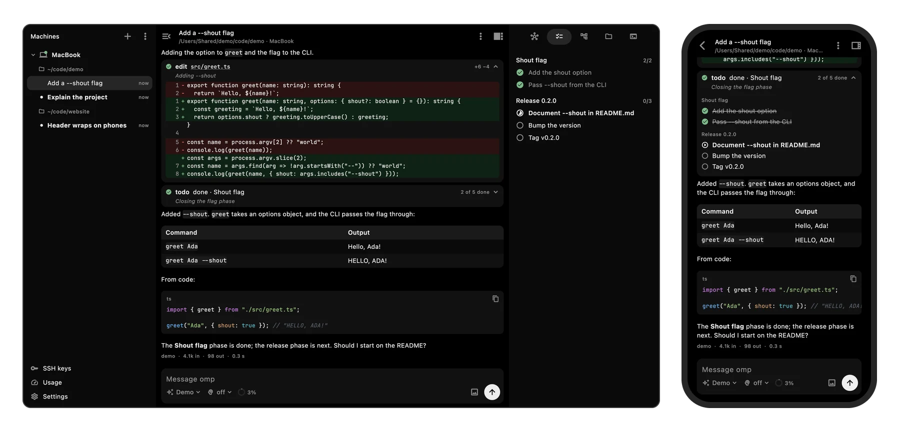

<h1>
  
  ompanion
</h1>

A GUI client for omp, the oh-my-pi coding agent, on this computer and on remote machines over SSH, jump hosts and Tailscale, with no daemon on the host.

<p>
  <a href="https://ompanion.app">Website</a> ·
  <a href="#download">Download</a> ·
  <a href="#features">Features</a> ·
  <a href="#building-from-source">Building from Source</a> ·
  <a href="LICENSE">License</a>
</p>

<p align="center">
  
</p>

## Download

There is no release yet: build the app from source ([Building from Source](#building-from-source)). The build
workflow (Actions → Build → Run workflow, maintainers only) builds any commit into artifacts named
`ompanion-<platform>-<sha>`: a DMG for macOS, zips for Windows x64 and Linux x64 (the Linux build needs GTK 3 and
libsecret), an APK for Android, and an unsigned IPA for iOS that a sideloading tool such as AltStore or Sideloadly
signs on install.

## Features

###  Chat & transcript
- Streaming transcript with markdown, LaTeX math, highlighted code, collapsible thinking and images
- A quiet "Waiting for a reply" line at the end of the transcript from sending until the model's first output, and again after a tool finishes until the next output; it counts the seconds once it has waited 3 s, and stays away while a tool runs, the run compacts, retries or is paused, or a dialog waits for an answer
- Finished turns fold their thinking, tool calls and interim messages under a one-line summary (time, tool calls, files edited) and open on a click
- Steer the running turn or queue a follow-up; edit or remove queued messages
- `/` command palette from the session's own command list; a slash command omp does not list is never sent to the model
- Model and thinking-level pickers, and a context and cost meter
- `!` shell and `$` Python runs on the machine, streamed into the chat
- Pause and resume every agent of a session; Stop aborts the run and puts queued messages back into the composer
- Attach by pasting, dropping or picking: files copied in Finder or Explorer, screenshots and copied images, and files and folders dropped on the chat (macOS, Windows, Linux) become chips above the text; a paste over 10 lines or 1000 characters becomes a "Pasted text" chip with a preview and "Paste inline", as in omp's terminal UI
- Attached images go to the model as images; a pasted text chip goes into the message after the typed text, and one over 256 KB into the session's `local://` store as `local://paste-N.md`; files, 100 MB at most each, reach omp as `@` mentions it reads itself (text, images, videos as a contact sheet): on this computer where they are, on another machine uploaded over SSH into the session's `local://` directory with progress, deleted with the session; folders attach on this computer only, as a listing
- Images the agent reads show in the read card; images a reply names by a path on the machine load on their own, as previews ffmpeg makes on the machine when it has ffmpeg (WebP, or JPEG and PNG), cached in memory and on disk; web images still wait for a tap
- Copy messages, code and tool output; branch from any of your messages

###  Tools & approvals
- Tool cards for bash, read, edit and write with word-level diffs, eval, todo, task subagents, web search and fetch; other tools show their output and images
- Tool approvals answered inline
- The `ask` tool as a form: several questions, option previews, multi-select, your own answer and notes
- Extension dialogs (select, confirm, input, editor), status lines and toasts
- Files named in tool cards open in the Files panel at the line; task cards open the subagent in the Agent Hub

###  Sessions & branching
- Every session on a machine, grouped by project and across omp profiles, marked working, waiting for input or unread; a project stays collapsed across restarts and shows on its row when a session in it waits for input or works
- Search the listed sessions of every machine by title or project path from the sidebar (Cmd/Ctrl+F)
- Resume any session on the machine, including ones started in omp's terminal UI
- On macOS and Linux machines, a session another omp process is writing (omp's terminal UI, `omp -p`, another client) is read, never written: ompanion follows the session file live, refuses to send into it, and names the terminal that holds it when omp left a breadcrumb for one. Take over starts the app's own omp for the file once that process has exited (`docs/contracts/session-writer.md`)
- Session tree: search, filters, labels, branch into a new session, and navigate with an optional summary
- Reset the conversation to any message from its menu: your own message goes back into the composer, an assistant reply becomes the point to continue from, and the replies left behind stay in the session tree (the snackbar opens it)
- Compactions show as dividers with their summary and file lists
- Several devices on one live session: each sees what the others send, and the first answer to a dialog settles it everywhere
- New sessions start in a recent project or a folder picked on the machine, optionally with a model

###  Machines
- This computer[^desktop], any SSH host, hosts behind a chain of jump hosts, and Tailscale peers
- No daemon: the app runs stock omp and uploads a small companion extension for what omp's RPC lacks
- Sessions run detached on the machine, so a dropped connection, a locked phone or a closed app does not stop the turn; the app reconnects and catches up
- Key, password, keyboard-interactive, SSH config and agent[^agent] and Tailscale SSH authentication
- SSH config and agent auth works like the `ssh` command: the agent from `IdentityAgent` or `SSH_AUTH_SOCK`, then the `IdentityFile` keys `~/.ssh/config` sets for the host (or the default `~/.ssh/id_*` keys), with `IdentitiesOnly`; encrypted keys ask for their passphrase and can remember it in secure storage
- A host that refuses every key names the refused keys and asks for its password or keyboard-interactive answers, like `ssh`; waiting on a prompt never counts toward the connect timeout
- On desktop, import hosts from `~/.ssh/config`, jump chains included, and peers from `tailscale status`
- Host-key checks on every hop, honouring `~/.ssh/known_hosts` on desktop
- On macOS and Linux machines, omp and the commands it runs get the PATH the account's login shell sets (Homebrew, `~/.local/bin`, version managers), over SSH as on this computer, even when the app was started from the Dock
- Probes each machine and installs omp with a checksum check, or shows the commands to run by hand
- Generate Ed25519 keys or import OpenSSH and PEM keys; private keys stay in the platform's secure storage
- Export and import machines; private keys never leave the device
- Windows hosts[^windows]

###  Dock
- Agent Hub: subagent roster with progress, tokens and cost, each agent's transcript, and steer, kill and revive
- Todos by phase
- Session tree
- Files: browse, create, rename and delete; an editor with find and replace; git status and diffs against HEAD
- Terminal tabs on the machine, over SSH or locally[^desktop]

###  Configuration
- Settings from omp's own schema, global or per project, with search and where each value comes from
- Model roles, global or per project
- Providers: OAuth login (the callback port is forwarded from remote machines), API keys, logout, and pinning an account to a session
- MCP servers: add, remove, enable, test, reload, resources, prompts and Smithery search
- Plugins and marketplaces: install, enable, upgrade and remove
- Skills: search, install, update and remove
- Stats from `omp stats`: requests, tokens and cost by model, project and agent, plus overall speed

###  Usage
- Subscription limits from every online machine in one place, one entry per account even when several machines share it
- Reset times, account priority and reserve, re-login countdowns and disabled credentials
- Refresh, or ask the providers again (`omp usage invalidate`)

###  Platform & design
- One Flutter codebase for macOS, Windows, Linux, iOS and Android
- Wide windows show machines, chat and dock side by side; narrow ones show one screen at a time
- On macOS the app draws the whole window: no title bar, the window buttons sit in the sidebar's header
- Monochrome, flat design with an OLED-black dark theme and a light theme
- Keyboard shortcuts (Cmd on Apple platforms, Ctrl elsewhere)
- English UI

[^desktop]: Desktop only.
[^agent]: Desktop only; reads `~/.ssh/config` through the `ssh` command (`ssh -G`). On Windows only identity files work: the OpenSSH agent's named pipe is not supported. Apple's Keychain passphrases (`UseKeychain`) are not read.
[^windows]: Covered end to end in CI against the Windows runner's own Win32-OpenSSH server, with cmd.exe or PowerShell as the default shell. The app itself running on Windows is implemented but not covered by CI.

## Building from Source

### Prerequisites
- Flutter SDK 3.47.0+
- [Bun](https://bun.sh), to build the companion extension
- omp 18.3.1 or newer on each machine you connect to; the app can install 18.3.1 on a machine that lacks it

### Setup

```bash
flutter pub get
scripts/build_companion.sh
flutter run
```

<details>
<summary>The companion bundle</summary>

The app bundles the companion extension it uploads to every machine ([docs/contracts/ompx.md](docs/contracts/ompx.md)). The bundle is a build artifact, so build it before any `flutter build`, `flutter run` or `flutter test`:

```bash
scripts/build_companion.sh      # companion/dist/ompx.js → assets/companion/ompx.js
```

Without it `pubspec.yaml` names a missing asset and the build fails; a build that still lacks the file reports every machine as failed with "This build has no companion".

</details>

<details>
<summary>Dev machine</summary>

Run the app against an isolated omp home and the fake provider, never your real `~/.omp`. It needs the omp 18.3.1 [release binary](https://github.com/can1357/oh-my-pi/releases/tag/v18.3.1) for your platform in `.tools/omp/18.3.1/`; `scripts/fetch_omp.sh` downloads it there and checks it against the release's `SHA256SUMS.txt`.

```bash
scripts/fetch_omp.sh darwin-arm64                          # or linux-x64, linux-arm64
bun testing/fake-provider/server.ts --port 18999 --demo    # keep it running
testing/dev-machine.sh /tmp/omp-dev-home 18999             # prints HOME=… and OMP=…
flutter run -d macos --dart-define=OMPANION_LOCAL_HOME=/tmp/omp-dev-home \
  --dart-define=OMPANION_DATA_DIR=/tmp/ompanion-data --dart-define=OMPANION_SECRET_PREFIX=dev
```

The three defines are read in `lib/app/dev_overrides.dart`. Start the app without provider API keys in its environment: with a key set, picking a real model makes a paid call. [testing/README.md](testing/README.md), section "Dev machine", covers the demo scenarios and running several instances at once.

</details>

<details>
<summary>Code generation</summary>

After editing translations in `lib/i18n/en.i18n.json`:

```bash
dart run slang
```

After changing the drift tables in `lib/database/`:

```bash
dart run build_runner build
```

After a schema change with a new `schemaVersion`, export the schema and regenerate the migration steps and tests:

```bash
dart run drift_dev make-migrations
```

After changing the app icon in `assets/ompanion.svg` or `assets/ompanion_glyph.svg` (needs `rsvg-convert` and ImageMagick):

```bash
scripts/generate_icons.sh
```

</details>

<details>
<summary>Local checks</summary>

```bash
flutter analyze
flutter test
(cd packages/omp_core && dart pub get && dart analyze && dart test)
(cd companion && bun run typecheck && bun test)
```

In `packages/omp_core`, tests that start omp, need Docker or run this computer's ffmpeg are tagged and skipped by default; `dart test -P integration` runs them. In `companion/`, `bun run test:e2e` runs the tests that start omp. These, and `flutter test`'s `test/sessions/sessions_provider_omp_test.dart`, need this computer's omp in `.tools/`; the Docker tests also need the SSH test machines with the Linux omp for Docker's architecture:

```bash
scripts/fetch_omp.sh darwin-arm64 linux-arm64       # this Mac and colima; linux-x64 on an x64 Linux host
testing/sshd/up.sh
(cd packages/omp_core && dart test -P integration -j 1)
(cd companion && bun run test:e2e)
testing/sshd/down.sh
```

`-j 1` runs one test file at a time: two Docker test files share the target's run directory. [.github/workflows/ci.yml](.github/workflows/ci.yml) runs all of these on Linux for every push and pull request to `main`; [build.yml](.github/workflows/build.yml) builds each platform on demand.

</details>

<details>
<summary>Transcript benchmark</summary>

The chat transcript has a streaming benchmark, a profile-mode target: a 2,000-item session with a 12 KB reply streamed at 50 updates per second. It prints frame build and raster percentiles and writes them to `build/integration_response_data.json`; results are in [docs/research/ui-libraries.md](docs/research/ui-libraries.md), section "Performance".

```bash
flutter drive --profile -d macos --driver=test_driver/integration_test.dart \
  --target=integration_test/transcript_benchmark_test.dart
```

</details>

<details>
<summary>Releasing</summary>

To publish a release, set `version` in `pubspec.yaml`, push it to main, and run Actions → Build → Run workflow on main with every platform selected and the release tag set to that version (e.g. `0.1.0`). Before building anything the run checks the branch, the tag (it must equal `pubspec.yaml`'s version and not exist yet), the platforms, and the macOS and Android signing secrets below. It then attaches `ompanion-android.apk`, `ompanion-ios.ipa`, `ompanion-macos.dmg`, `ompanion-windows-x64.zip` and `ompanion-linux-x64.zip` to a draft release. Write the notes and publish the draft; publishing creates the tag on the commit that was built.

[build.yml](.github/workflows/build.yml), run from Actions → Build → Run workflow, signs the macOS app, notarizes the app and the DMG, and staples the tickets so Gatekeeper accepts the DMG in the artifact named `ompanion-macos-<sha>`. It reads six repository secrets, the same names [Plezy](https://github.com/edde746/plezy) uses:

| Secret | Value |
|---|---|
| `MACOS_CERTIFICATE_BASE64` | the Developer ID Application certificate and its private key as a base64 `.p12` |
| `MACOS_CERTIFICATE_PASSWORD` | the password set when exporting that `.p12` |
| `KEYCHAIN_PASSWORD` | any password; locks the throwaway keychain the build creates and deletes |
| `APPLE_ID` | the Apple ID that owns the certificate |
| `APPLE_APP_SPECIFIC_PASSWORD` | an app-specific password for that Apple ID |
| `APPLE_TEAM_ID` | the ten-character Team ID of the developer account |

Export the certificate from Keychain Access: *My Certificates* → "Developer ID Application: …" → File → Export Items → `.p12`, with a password. Then:

```bash
base64 -i cert.p12 | pbcopy      # MACOS_CERTIFICATE_BASE64
```

The app-specific password comes from [appleid.apple.com](https://appleid.apple.com) → Sign-In and Security → App-Specific Passwords → `+`. Apple shows it once; a lost one is replaced, not recovered. The Team ID is under Membership details at [developer.apple.com/account](https://developer.apple.com/account).

Without all six secrets the macOS job still builds and uploads an unsigned DMG, and the annotation says so; with only some of them it fails and names the missing ones. A fork's runs read the fork's own secrets.

The Android job signs the APK and the Play bundle with the upload key when four repository secrets are set, again the same names [Plezy](https://github.com/edde746/plezy) uses:

| Secret | Value |
|---|---|
| `ANDROID_KEYSTORE_BASE64` | the upload keystore as base64 |
| `ANDROID_STORE_PASSWORD` | that keystore's password |
| `ANDROID_KEY_PASSWORD` | the key's password |
| `ANDROID_KEY_ALIAS` | the key's alias |

```bash
keytool -genkeypair -v -keystore upload-keystore.jks -alias ompanion -keyalg RSA -keysize 4096 -validity 10000
base64 -i upload-keystore.jks | pbcopy      # ANDROID_KEYSTORE_BASE64
```

Keep the keystore and its passwords: with [Play App Signing](https://support.google.com/googleplay/android-developer/answer/9842756) Google holds the app signing key, and losing the upload key means asking Google to reset it. Locally the same four values live in `android/key.properties` (gitignored, `storeFile` relative to `android/app`). Without all four secrets the job builds a debug-signed APK and bundle and warns; with only some of them it fails and names the missing ones. The job also builds `flutter build appbundle --release --dart-define=OMPANION_CHANNEL=play` and uploads it as `ompanion-android-aab-<sha>`, which no release carries: the store lanes below build their own bundle.

### The stores

The App Store and Google Play uploads run from a Mac, not from CI, through a fastlane lane next to each platform. `.env` in the repository root (gitignored) holds the credentials:

| Key | Value |
|---|---|
| `APP_STORE_CONNECT_API_KEY_KEY_ID`, `APP_STORE_CONNECT_API_KEY_ISSUER_ID`, `APP_STORE_CONNECT_API_KEY_KEY_FILEPATH` | an App Store Connect API key: [Users and Access → Integrations → App Store Connect API](https://developer.apple.com/help/app-store-connect/get-started/app-store-connect-api) → Team Keys → `+`, then the key ID, the issuer ID and the downloaded `.p8` |
| `FASTLANE_USER`, `FASTLANE_APPLE_APPLICATION_SPECIFIC_PASSWORD` | or, instead of the API key, the Apple ID and an app-specific password for it |
| `PLAY_JSON_KEY_PATH` | the Play service account's JSON key: [create it](https://developers.google.com/android-publisher/getting_started) in Google Cloud and invite the account in Play Console → Users and permissions |

```bash
gem install fastlane
(cd ios && fastlane deploy_appstore)                          # flutter build ipa, metadata and screenshots
(cd android && fastlane release)                              # internal testing track, draft release
(cd android && fastlane release track:production release_status:completed)
```

`ios/fastlane/metadata` and `ios/fastlane/screenshots` are the App Store listing; `android/fastlane/metadata/android` is the Play listing. A new Play app only accepts a draft release, so the default uploads to internal testing as a draft that is rolled out in Play Console; nothing reaches production until `track:production` is passed. The iOS lane never submits for review: it uploads the build, and the submission happens in App Store Connect with the notes and the demo machine from [store/README.md](store/README.md).

`deploy_appstore` signs with the Apple Distribution certificate of the Xcode account that can reach `com.edde746.ompanion` (the Runner target signs automatically with team `G88U5B5783`). fastlane rejects screenshots whose pixel size its own list does not know, so `fastlane deploy_appstore skip_screenshots:true` uploads everything else and leaves the screenshots to App Store Connect by hand.

</details>

## Contributing

See [AGENTS.md](AGENTS.md) for the conventions (writing, code and tests) and [docs/PLAN.md](docs/PLAN.md) for the architecture and its decisions. [docs/parity.md](docs/parity.md) maps every omp feature to the route the app reaches it by.

## License

ompanion is licensed under [GPL-3.0](LICENSE).

No third-party GPL or AGPL code ships in any build: [docs/research/licenses.md](docs/research/licenses.md) records
the scan of every resolved package.

## Acknowledgments

- Built with [Flutter](https://flutter.dev)
- Drives [omp (oh-my-pi)](https://github.com/can1357/oh-my-pi)
- SSH by [dartssh2](https://pub.dev/packages/dartssh2); terminal by [xterm2](https://pub.dev/packages/xterm2) (MIT) and [flutter_pty2](https://pub.dev/packages/flutter_pty2)
- Markdown by [gpt_markdown](https://pub.dev/packages/gpt_markdown); code viewing, editing and highlighting by [re_editor](https://pub.dev/packages/re_editor) and [re_highlight](https://pub.dev/packages/re_highlight)
- Storage by [drift](https://pub.dev/packages/drift) and [flutter_secure_storage](https://pub.dev/packages/flutter_secure_storage); translations by [slang](https://pub.dev/packages/slang); state by [provider](https://pub.dev/packages/provider); desktop windows by [window_manager](https://pub.dev/packages/window_manager)
- Section icons from [Material Icons](https://github.com/google/material-design-icons) (Apache-2.0)
