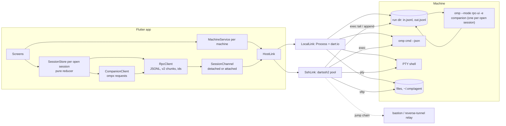

# ompanion — plan

Flutter client for [omp](https://github.com/can1357/oh-my-pi) with TUI parity, driving omp on many
machines without a host daemon. Reference product: [T3 Code](https://github.com/pingdotgg/t3code),
limited to omp.

Status: 1.0.0 is built; this file is the plan it was built to and still names surfaces that are not built. What
the app does is the README's feature list; the status paragraph of `parity.md` says which omp features have no
surface of their own. The companion implements more verbs than the app calls: nothing calls `sessions.list`,
`session.fork`, `session.clear`, `session.delete`, `context.breakdown`, `history.search`, `btw`,
`queue.get`/`queue.pop`, `goal.set`, `goal.guided` or `loop.enable` (the app starts a goal or a loop through the typed
command; `contracts/ompx.md`). The App Store and Play build lanes exist; nothing is uploaded (§9). Notifications
are built (M10). Phone builds carry the Firebase project's config (`android/firebase.properties`,
`ios/Flutter/Firebase.xcconfig`), and the relay runs at `push.ompanion.app` (`relay/README.md`). A message sent
through it reached an Android emulator on 2026-09-27; delivery to an iPhone is untested (`contracts/push.md`).
M0's spike results are in `research/`. Numbers were measured on 2026-09-25 (omp 18.3.0 installed, source read at
tags v18.3.0 and v18.3.1, Flutter 3.47.1, Dart 3.13.1) unless marked [INFERENCE].

| Doc | Contents |
|---|---|
| `parity.md` | the parity contract: every omp feature, its route, its surface, its milestone |
| `research/omp-surface.md` | RPC commands and frames, slash commands, CLI `--json`, approval frames, keybinding actions |
| `research/companion-reach.md` | what a companion extension can reach in 18.3.1, API paths, what stays unreachable |
| `research/integration-options.md` | RPC vs CLI vs files vs companion vs daemon, install paths |
| `research/remote-transport.md` | SSH, dartssh2, jump hosts, Tailscale, T3 Code's remote design, detached sessions |
| `research/windows-hosts.md` | Win32-OpenSSH behaviour, probes, install, attached and detached sessions |
| `research/voice.md` | omp voice and live mode, what a phone must do instead |

The research docs record every option considered, including rejected ones. This file records the
decisions.

## 1. Goal

- Every omp feature a TUI user can reach is reachable in the app, except the ones excluded in
  `parity.md` by decision.
- Machines: this computer (desktop), SSH, SSH through jump hosts, hosts behind NAT reached through a
  reverse tunnel, Tailscale.
- Client platforms: macOS, Linux, Windows, iOS/iPadOS, Android.
- Host platforms: macOS, Linux, Windows.
- Beyond omp: integrated terminal, file explorer and editor, port forwards, notifications (push on phones, local on
  desktops).
- omp versions: 18.3.1 (the newest release today) and every later release as it ships. Nothing older.
- Out of scope: T3-style git/PR panels, worktree-per-thread orchestration,
  live attach to running TUI sessions, omp's `/git` overlay, `omp commit`, collab, recording and
  streaming, Codex realtime voice (omp's `/live` model), plan mode and plan review, vibe mode.

## 2. Decisions

| # | Decision | Why / cost |
|---|---|---|
| D1 | No host daemon. The app drives stock omp: one `omp --mode rpc-ui` process per open session, `omp <cmd> --json` one-shots, SFTP, PTY. | User choice. Nothing to install beyond omp and one script. Cost: every gap in RPC goes through the companion (D3), and each open session is its own process with a cold start (1.7 s locally to `ready` plus four introspection commands). |
| D2 | `rpc-ui`, not `rpc`. | Only `rpc-ui` registers the `ask` tool and hands tools a UI context. It forces `PI_NO_PTY=1`, which is correct for a pipe. `--no-ui` would silence the companion and is not used. |
| D3 | RPC gaps are closed only by a companion extension: one script the app uploads and loads with `-e` into every rpc process. No upstream omp changes. | User choice. The companion reaches the live main session through `pi.pi.AgentRegistry.global().get(pi.pi.MAIN_AGENT_ID).session`, plus settings with their schema, auth storage, the model registry, session listing, tree navigation, labels, queues, subagent control, user bash and Python, `runEphemeralTurn`, themes (`research/companion-reach.md`). Cost: it depends on omp internals and must be tested against every omp version it serves (§6). |
| D4 | Protocol v2 is mandatory. The Dart client negotiates v2 and reassembles `rpc_chunk` frames. | `get_available_models` fails on v1 with `RPC response exceeded the transport limit`; on v2 it is 8 chunks, 2,039,508 bytes, 1,039 models. Cached per machine and omp version. |
| D5 | Every session runs detached from the SSH channel: a per-session run directory, commands appended to `in.jsonl`, output appended to `out.jsonl`. POSIX hosts feed omp with `tail -f in.jsonl | omp`; Windows hosts start omp through WMI with job breakaway and a PowerShell byte pump (§5). | User choice. A dropped connection, a locked phone or a closed app no longer aborts the running turn. Both forms are built: `packages/omp_core/test/channel/` and `packages/omp_core/test/windows/` cover them, and CI's `windows-host` job runs the Windows form end to end. |
| D6 | Any device may send to a live session at any time. Appends are serialized by a short lock; every device also tails `in.jsonl` to see what the others sent. Dialogs are settled by the first answer. | User choice. omp ignores `extension_ui_response` frames with unknown ids, so a late second answer is harmless. |
| D7 | One SSH stack on every client platform: `dartssh2` 4.1.0 (MIT, 2026-09-04), pinned exactly. "This computer" on desktop uses `Process` with the same framing. | Only pure-Dart SSH works on iOS and Android. Covers exec, PTY, SFTP, `-L/-R/-D`, unix-socket forwards, jump-host chains, encrypted OpenSSH keys, keyboard-interactive, `none` auth. App-side work: known_hosts, an ssh-agent client, `~/.ssh/config`, ProxyCommand, dead-peer detection. Channel-stall fixes landed in 3.1.0 and 4.0.1, hence the exact pin. |
| D8 | Jump hosts are a connection property: an ordered chain, each hop with its own auth and host-key check. A host behind NAT with a reverse tunnel is a jump through the relay host to `localhost:<port>`. | `SSHClient(await jump.forwardLocal(target, 22))`, chainable. One code path for bastions and reverse tunnels. |
| D9 | Desktop reads `~/.ssh/config` through `ssh -G <alias>` and lists aliases from `Host` lines and `Include`. Phones: manual entry, pasted config, or import from a desktop. | No maintained Dart parser exists. `ssh -G` gives the effective config including `Match`. |
| D10 | Tailscale through the OS client; machines are dialed over SSH by MagicDNS name or 100.x address. Discovery: `tailscale status --json` on desktop, and machine import from a desktop (records only, never private keys). A peer added from `tailscale status` uses `none` auth (Tailscale SSH), and desktop pre-trusts its `sshHostKeys`. | User choices (OS client; CLI status and import). Phones need the Tailscale app running. `none` auth is tested against an sshd that allows it, not against a tailnet (§12). |
| D11 | Port forwards per machine: automatic `-L` for OAuth callback ports during `login` is built; user-defined `-L` for previews and `-R 9224` for the browser relay are not. | RPC `login` redirects to the host's loopback (anthropic 54545, openai-codex 1455, …). Phones fall back to pasting the redirect URL. |
| D12 | Bootstrap: probe (POSIX `sh -s` script; Windows `powershell -EncodedCommand`), then install with the official installer pinned to a release and `--binary` (`-Binary` on Windows), or upload a release asset and check its SHA-256. Manual mode shows the commands. The absolute omp path is stored. | Auto and manual install were both requested. Without `--binary` the installer prefers `bun install -g`; on Windows `-Ref` alone means a source install. Non-login shells and fresh Windows sessions miss the install dir on PATH. |
| D13 | TUI sessions on the same machine are listed from disk and opened by resuming them in a new rpc process, unless another omp process still holds the file (D21). | User choice. omp has no liveness marker for a TUI holding a session (`.lock.os` is a per-write gate), so the app probes for one itself (D21, R6). |
| D14 | The app sends a slash command as prompt text only if the live `get_available_commands` list contains it. The companion registers its channel command, `ompx`, and `goal`, `guided-goal` and `loop`, which it runs itself; any other typed TUI-only name (`/pause`, `/tree`, `/btw`, …) is not listed and is not sent; pause and the session tree have controls of their own in the app. | 40 TUI-only builtins are not handled in RPC; sent as text they reach the model as a paid turn (#13281). RPC does not reserve those names, so the companion may claim them. |
| D15 | License GPLv3 (`LICENSE`), with no additional permissions. | User choice as the sole copyright holder, who publishes the store builds (R11). Third-party AGPL/GPL code stays out of every build, which is why the terminal is MIT (D17). |
| D16 | One codebase for every store. Features a store forbids are compiled out with `--dart-define` flags, or worked around. | User choice. Known cases: local omp and `~/.ssh` access inside the Mac App Store sandbox, host access from Flatpak, background execution on iOS, auto-update outside GitHub builds. |
| D17 | Flutter stack follows Plezy: `provider`, `drift`, `slang`, `window_manager`, `flutter_secure_storage`. Markdown `gpt_markdown` 1.3.0 with a CommonMark code-fence rule (its own parser mishandles nested and `~~~` fences); settled segments cached, only the streaming tail re-parsed. Highlighting `re_highlight` in an isolate. Transcript list: built-in slivers around a center anchor with a stick-to-bottom `ScrollPhysics`, no list package. Terminal `xterm2` 5.2.0 in every build (MIT); PTY `flutter_pty2` 2.0.0, and ompanion paces PTY output into the terminal itself (`lib/terminal/frame_writer.dart`: a parsing-time budget per frame and back-pressure on the PTY or SSH channel), which `xterm3` shipped and `xterm2` does not. Code viewer/editor `re_editor` 0.10.0; diffs rendered from omp's numbered diff format and `git diff`. | Same conventions as the author's other Flutter app. Evidence and rejected options: `research/ui-libraries.md`. |
| D18 | Repository: Flutter app at the root; `packages/omp_core/` (pure Dart: transport, SSH, host scripts, session channels, RPC and companion clients, session store); `companion/` (TypeScript, Bun); `relay/` (the push relay, a Bun server, D24); `harness/` (fake OpenAI-compatible provider, isolated omp homes, recorded fixtures, SSH test containers); `docs/`. | The app and the companion version together; one companion build serves every supported omp version (§6). Pure Dart keeps the protocol and transport testable with `dart test` and drivable from a CLI without Flutter. Tests never call a paid provider: omp runs against the fake provider in an isolated `HOME`. |
| D19 | Material 3 look. omp theme palettes are not used for the app's own colours. | User choice. omp's `theme` settings stay editable as TUI settings. |
| D20 | The probe asks the account's login shell for its PATH once per connection (`$SHELL -l -i -c`, falling back to `-l -c`, bounded, between markers into a private file), and every launch puts that PATH in front of omp's own. On POSIX only. | An SSH exec channel's PATH is sshd's default, so Homebrew, `~/.local/bin` and nvm are missing from omp's bash tool (`gh` exit 127); the same for a Dock-launched app on macOS. `-i` because PATH commonly lives in `.zshrc`/`.bashrc`. The wrapper's own `tail`/`ps` keep sshd's PATH. Contract: `contracts/host-launch.md`. |
| D21 | A session file another omp process holds (a process with it open for writing, or omp's terminal breadcrumb with a live omp on that tty) is read, never launched into or attached to: the app shows the transcript from the file, refuses to send, and offers Take over only once that process is gone. A run of the app for that file is killed first, as is one whose omp is behind the file. POSIX only; Windows keeps the old behaviour. | Two writers on one session file interleave turns and each process's next rewrite drops the other's entries (measured: a terminal omp mid-turn plus the app's second omp, `session_exit` written into the terminal's live session). omp's steering/follow-up queue is in that process's memory only, so the app says so instead of faking it. Contract: `contracts/session-writer.md`. |
| D22 | Phones get push notifications through Firebase Cloud Messaging (FCM); desktops show local notifications for the sessions they have open. Kinds: needs input, done, failed, each switchable per device. | User choice. FCM has no per-message cost; its limits are 600,000 messages a minute per project and 240 a minute or 5,000 an hour per Android device. A desktop app notifies only while it runs (macOS quits with its last window), which is also when it tails its sessions. |
| D23 | The companion in every detached run sends the pushes. A phone registers by leaving `~/.ompanion/push/<deviceId>.json` (its Firebase installation ID, its key, the kinds it wants) on each machine it connects to while push is on. Every registered phone gets every notification of the kinds it asked for, whether or not a device is attached; a phone hides only the one for the session it shows in the foreground. | No daemon (D1): while nobody is connected, the run's companion is the only host code alive. User choice over presence tracking: always push. The kinds are filtered on the machine because FCM lowers the priority of an Android install that receives high-priority messages and shows nothing. |
| D24 | A relay, the Bun server in `relay/`, runs in Docker on our own VPS behind its reverse proxy at `push.ompanion.app`; it holds the FCM service account, forwards messages and keeps no state. Payloads are AES-256-GCM encrypted with a key the phone makes, which reaches machines only over SSH. Contract: `contracts/push.md`. | Sending through FCM needs the project's service-account key, which cannot ship in the companion: anyone holding it could push to every install. User choices: run the relay on the VPS we already have; encrypt end to end. The relay, Google and Apple see a Firebase installation ID and ciphertext only. TLS and the reverse proxy are the VPS's own setup, not part of the repository. |
| D25 | Firebase Messaging is integrated natively: the Android SDK in `android/`, the iOS SDK through Swift Package Manager in the Runner target only. Android decrypts and posts in its `FirebaseMessagingService`; iOS decrypts in a Notification Service Extension. Desktops use `flutter_local_notifications`. A build without the Firebase config has no push and says so. | `firebase_core` carries a Windows plugin that downloads the Firebase C++ SDK (963,150,774 bytes, measured 2026-09-27) on every Windows build. Native decryption posts within Android's few seconds per message without starting a Dart isolate, and iOS needs the extension in any case to replace the encrypted placeholder. |

## 3. Architecture

Layers, each owning one thing:

- `HostLink` — `exec(command, stdin)`, `pty(size)`, `sftp`, `forwardLocal/Remote`. Two implementations:
  `LocalLink`, `SshLink`. SSH connections are pooled per host, because sshd's `MaxSessions` default of
  10 counts exec, shell and sftp channels on one connection.
- `SessionChannel` — the byte stream to one omp process. `DetachedChannel` launches or finds the run
  directory, tails `out.jsonl` and `in.jsonl` from stored offsets, and appends commands.
  `AttachedChannel` owns the process's stdio directly.
- `RpcClient` — skips bytes before `ready` (shell noise), negotiates v2, validates and reassembles chunks
  (64 MiB cap), correlates responses by device-namespaced ids, exposes typed frames. Pure Dart, tested
  against recorded frames.
- `CompanionClient` — `ompx` requests and replies over the same channel (§6).
- `SessionStore` — `(view, frame) → view`. Rebuilt from `get_state`, `get_messages_page` and
  `get_entries(since)` on attach; events apply on top. Offset replay is an optimisation, never required
  for correctness. A run ends at `agent_end` only when `isTerminal !== false`, or at `session_settled`.
- `MachineService` — probe, install, companion upload, CLI one-shots with a cache, session index, file
  operations, forwards.

Machine records, host keys, settings, read markers and sidebar pins live in drift; private keys and passwords in
`flutter_secure_storage`. Private keys never leave the device that created or imported them.

## 4. Machines

| Type | Reaches | Auth | Discovery |
|---|---|---|---|
| This computer (desktop) | `Process` | none | automatic |
| SSH | host:port | key (in-app, or ssh-agent on desktop), password, keyboard-interactive | desktop `~/.ssh/config`, manual, import |
| SSH through jump hosts | hop chain, then target | per hop | `ProxyJump` from `ssh -G`, manual |
| Reverse tunnel | relay host, then `localhost:<port>` | per hop | manual |
| Tailscale | MagicDNS name or 100.x over SSH | SSH key or Tailscale SSH `none` | `tailscale status --json` (desktop), import |

Per-host facts the app stores after the probe: OS, arch, libc, shell, home, agent dir, absolute omp path,
omp version, the login shell's PATH (or why it could not be read: `contracts/host-launch.md`), and for
Windows the OpenSSH default shell and PowerShell version.

Liveness: dartssh2's keepalive never declares a peer dead, so the app pings with a timeout (3 × 15 s),
reconnects with jittered backoff, and stops on auth failure. Nothing probes on app resume or network change
(`SshLink.probe` has no caller in the app).

Session listing is one exec round trip (a PowerShell script on Windows): a script prints `{path, size, mtime,
profile, title, header, first}` for every `*.jsonl` under the default agent directory's `sessions/`,
`PI_CODING_AGENT_DIR`, `$XDG_DATA_HOME/omp` and every profile, reading only the first 16 KiB of each file: the fixed
title slot, the header line and the start of the first user message's text (for untitled sessions). The script
also takes `--session-dir` directories, which the app does not pass; the companion's `sessions.list` is not used.

## 5. Session processes

Closing an rpc process's stdin or stdout disposes the session, and dispose aborts the running turn
(`rpc-mode.ts` 837-840, `agent-session.ts` 4908). That is why sessions do not run on the SSH channel
itself. Measurements and the reason for each step: `research/m0-detached-sessions.md`. Code:
`packages/omp_core/lib/src/channel/` (run directories) and `lib/src/session/` (`MachineRuntime`,
`LiveSession`); `dart run omp_core:ompctl` drives both from a terminal.

### Detached runs (macOS and Linux hosts, and this computer on macOS/Linux)

Run directory `~/.ompanion/run/<runId>/`, mode 0700:

| File | Purpose |
|---|---|
| `in.jsonl` | every command from every device, one JSON line each |
| `out.jsonl` | omp's stdout, plus the app's markers: `ompanion_exit` after omp exits, `ompanion_rotate` first in a rotated generation |
| `err.log` | omp's stderr |
| `meta.json` | session file, cwd, omp, companion, launch args, `out.jsonl` generation |
| `run.sh`, `omp.pid`, `tail.pid`, `exit` | the pipeline, liveness, exit code |
| `overlay.yml` | the `--config` overlay; its path in omp's command line identifies the process |
| `in.lock/` | `mkdir` lock held for one append, a rotation or a `meta.json` update |

- Launch (`openRun`, under `~/.ompanion/run/.launch.lock`): a running run whose `meta.json` names the
  session is reused. Otherwise `run.sh` starts in a new session (`setsid`, Perl's on macOS):
  `tail -f in.jsonl | omp --mode rpc-ui --config overlay.yml --cwd <cwd> -e <companion> [--session <file>]
  [--model …] [--thinking …] >> out.jsonl 2>> err.log`, then records omp's exit code. omp runs with the
  login shell's PATH in front of its own, and the pipeline's `tail`/`ps` keeps sshd's
  (`contracts/host-launch.md`).
- Session file: a new session starts without `--session`, so omp names its file
  (`sessions/<cwd>/<time>_<id>.jsonl`) and writes it with the first message. The first attach reads
  `get_state.sessionFile` and records it in `meta.json` before `open` returns; every later switch inside
  the run (`new_session`, `switch_session`, `branch`, fork, `/clear`, tree navigation) is recorded the same
  way. A device opening that file attaches to the run instead of launching a second omp.
- Attach: `tail -F` from saved offsets on both files; what `out.jsonl` already holds goes out through a plain
  `tail` first (BSD `tail -F` copies byte by byte). A device's first attach to a generation over 8 MiB
  (`attachWindow`) gets a compacted replay, then follows the log from the end of its last complete line. From before
  the last 8 MiB it holds only what RPC cannot list again: `extension_ui_request` (dialogs, statuses, widgets),
  `command_output`, and the start of each tool call still running; a timed dialog whose tool calls all ended is left
  out. From the last 8 MiB it drops each `message_update`, `tool_execution_update` and `subagent_progress` that a later
  frame of the same message, tool call or subagent supersedes. One JavaScript script compacts on every host
  (`replayScript`): the app uploads it next to the companion and runs it with the probe's omp binary as Bun
  (`BUN_BE_BUN=1`, 74 ms to start). A live 1.6 GB generation compacts to 58 lines, 647 KB, with the header on the
  device 0.4–0.7 s after the attach starts on macOS; a 1 GB log on a Windows host in 0.9 s, PowerShell included.
  Replayed whole, the 1.6 GB took 62 s and 3.1 GB of app memory. `in.jsonl` is read from 0
  (open dialogs and the answers that closed them). The device then seeds the view
  from `get_state`, the session history, `get_available_commands`, `get_subagents` and the companion's `hello`,
  `state.snapshot` and `agents.list`. The history is the session file `meta.json` names, read while omp
  starts, plus `get_entries(since)` its last entry (a file over 16 MB: its last 2 MB, earlier 2 MB pages as the reader
  scrolls up); plain `get_entries` when there is no file or omp does not
  know that entry. Every frame, and every `extension_ui_response` any device appends, goes through the
  reducer.
- Send: one long-running appender per channel takes `in.lock` per line; lines over 64 KiB are uploaded
  first.
- Link loss: a session reconnects with jittered backoff (1 s doubling to 30 s) and continues from the last
  frame boundary it read; a rotation it missed rebuilds the view from RPC. Refused credentials or host
  keys, a removed run and an omp that cannot start end the session.
- Stop: kill the feeding `tail`; omp drains and exits 0. Force: SIGTERM (exit 143). Detaching, closing the app and
  losing the link never stop a run; the user's Stop and the idle exit do.
- Idle exit: every run's omp gets its run directory and `MachineRuntime.idleExit` (1 h) in its environment
  (`contracts/host-launch.md`). After that long without a session event, companion call, pause change or roster change,
  and with nothing an exit would cut short or lose (a turn, queued messages, background jobs, the pause gate, loop
  mode, an active goal, a running subagent, an open dialog, a call in flight), the companion sends `run.idleExit` and
  stops omp as Stop does (`contracts/ompx.md`). The chat says why the session ended, and a send opens the session file
  in a new run: a cold open instead of an attach. A session that ended before its first message opens as a new one.
- Rotation: every `message_update` carries the whole message, so one 1.5 KB streamed answer wrote 270 KB.
  When a run settles and `out.jsonl` holds 8 MiB, the device that read past that mark truncates it under
  `in.lock` at the offset it has read, once its own requests are answered: the `get_state` its `agent_end` asked for
  and the entries catch-up are answered after the settle, and a log checked against the settle's offset was never
  rotated (a live run's generation reached 1.6 GB). Anything else omp writes after the settle, a command other than a
  `get_*` query from any device, or an active goal or running loop about to start the next turn on its own (omp's
  writes do not take `in.lock`) leaves the log for the next settle. Devices that had read everything follow, the
  others rebuild from RPC. A restarted omp gets a new run directory, never an old `in.jsonl`.
- Garbage collection: `removeDeadRuns` deletes the directories of runs whose omp is gone. The app runs it with every
  session listing for runs whose `out.jsonl` last changed over 3 days ago (`deadRunLifetime`); `ompctl gc` removes
  every ended run.
- Secrets never go through `in.jsonl`: they reach the companion as 0600 files uploaded over SFTP and
  deleted after use.

### Control process

Settings, roles, accounts, login and model lists need no session. One `omp --mode rpc-ui --no-session -e
<companion>` per machine runs on an exec channel of the link, started on first use and again after it exits,
with the login shell's PATH like every other launch (`contracts/host-launch.md`). omp refuses rpc mode on a
machine with no usable model ("No models available"); the control then runs in bootstrap mode:
`--model minimax/MiniMax-M2 --api-key ompanion-bootstrap`. The model is bundled in omp's catalog and has no
discovery. `--api-key` is a runtime override that is never persisted. The channel refuses every model call (prompts other than `/ompx`, `btw` and `tree.navigate` calls, `compact`, `handoff`). After
`accounts.setKey` or a successful `login`, the next `control()` starts a normal process.

### Windows hosts (and this computer on Windows)

Same run directory layout under `%USERPROFILE%\.ompanion\run\<runId>\`. CI's Windows host job runs it end to
end against Win32-OpenSSH on `windows-latest` (`packages/omp_core/test/windows/`). Differences, from
`research/windows-hosts.md`:

- Launch: sshd puts the channel's first process in a job with `KILL_ON_JOB_CLOSE`, so children started
  with `Start-Process`, `start` or `&` die with the channel. omp is started through WMI
  `Win32_Process.Create` with `CREATE_BREAKAWAY_FROM_JOB` (0x01000000); WMI-created processes are
  outside that job. Command line: `cmd.exe /d /s /c "powershell -NoProfile -File feed.ps1 <run> |
  <omp.exe> --mode rpc-ui --config <run>\overlay.yml -e <companion> [--session <path>] >> <run>\out.jsonl
  2>> <run>\err.log"`. cmd redirection passes bytes through unchanged; PowerShell 5.1 redirection does
  not.
- Feed: `feed.ps1` is a byte pump from `in.jsonl` (opened for reading with `ReadWrite, Delete` sharing) to stdout, polling
  every 50 ms, exiting when `in.jsonl.stop` appears. Its exit closes omp's stdin. Windows has no
  signals; closing stdin is omp's only graceful stop (`Stop-Process -Force` skips cleanup).
- Scripts run as `powershell -NoProfile -NonInteractive -ExecutionPolicy Bypass -EncodedCommand
  <base64 UTF-16LE>`, which works under a cmd, PowerShell or bash default shell. cmd caps a line at
  8191 characters, so larger scripts are uploaded over SFTP and run with `-File`.
- Attach: SFTP stat and offset reads on `out.jsonl` and `in.jsonl`; a first attach to a log over 8 MiB runs the replay
  script through PowerShell into a file in the run directory, as PowerShell 5.1 re-encodes a native program's output,
  and reads that over SFTP. `meta.json` updates go over SFTP under the launch lock. `out.jsonl` is never rotated:
  cmd.exe's `>>` keeps its offset, so a Windows run's log grows until the run ends.
- Send: one long-running PowerShell appender per channel opens `in.jsonl` per line for writing with `Read,
  Delete` sharing, so a second appender's open fails with a sharing violation and retries: the handle is the
  append lock. SFTP cannot append while omp runs: Win32-OpenSSH's sftp-server opens for writing with
  `FILE_SHARE_WRITE` only, which fails (`error:32`, SFTP status 4) against `feed.ps1`'s read handle.
- Environment: a WMI child gets the provider's environment block, so `USERPROFILE`, `LOCALAPPDATA` and
  `PATH` are set explicitly.
- Orphans: found by the overlay path in their command line through `Get-CimInstance Win32_Process`.
- A Windows machine with Git Bash or another POSIX default shell runs the same scripts through `sh -c`; only
  cmd.exe and PowerShell as the default shell run in CI.

### Per-launch config overlay

Every run gets `overlay.yml`: the app's session settings (`MachineRuntime`'s `overlay`, dotted keys),
with `speech.enabled: false` forced (otherwise the `ask` tool speaks on the host's speaker).

## 6. Companion extension

A TypeScript extension in `companion/`, uploaded to `~/.ompanion/companion/<omp-version>/` (outside omp's
auto-discovery roots, so the user's TUI never loads it) and passed with `-e`. It imports only exported
subpaths of `@oh-my-pi/pi-coding-agent`, which the compiled omp serves from its own bundle.

Wire:

- App → companion: RPC `prompt` with `/ompx {"callId", "verb", "args"}`. Extension commands run before the
  agent, even while streaming, and add nothing to the transcript.
- Companion → app: `{"type": "ompx"}` frames (replies, pushed events, and requests such as `ask`) written
  through `ctx.ui.output`; a companion request is answered by an `extension_ui_response` frame that settles
  through `ctx.ui.pendingRequests`. Both are TypeScript-private fields; the companion feature-checks them and
  falls back to `setStatus("ompx", …)` frames, which carry no requests. Frames over 1 MiB are chunked by v2 up
  to 64 MiB. Contract: `contracts/ompx.md`.
- Push: the companion subscribes to `pi.on(...)` events, `AgentRegistry.onChange` and session events,
  and emits queue, roster, mode and settings snapshots.
- Detection: `ompx` appears in `get_available_commands` with `source: "extension"`; its `hello` reply
  carries the companion build and `pi.pi.VERSION`.

What it implements, by class (`not built` rows are the plan; details and API paths in `research/companion-reach.md`):

| Class | Items |
|---|---|
| Thin wrappers, built (the status paragraph at the top lists those the app does not call) | settings with schema (type, enum, default, tab, group, scope provenance), model roles, session listing, fork, `/clear`, delete, queue list and dequeue, subagent steer/kill/revive, pause and resume, user bash with streaming and `excludeFromContext`, user Python, `/btw`, prompt history search, context breakdown, logout and account lists, account pin, API-key login (`accounts.setKey`), full-fidelity `ask` via `ctx.ui.askDialog` |
| Rebuilt from session APIs, built | goal and guided goal (including continuation, completion and restore), loop (including `--while`/`--until` conditions and limits) |
| Rebuilt from session APIs, not built | `/omfg`, `/tan`, provider setup, agents dashboard, extensions control center |
| App only, no companion, not built | push-to-talk, reply TTS (§8) |
| Other routes, built | project-scope settings (edit `.omp/config.yml` over SFTP; rpc-ui watches it) |
| Other routes, not built | `/cleanse` (`omp cleanse` one-shot; `src/cleanse` is not exported) |
| Unreachable | extension TUI components |

Anything that must keep working while no device is attached runs in the companion, not the app: goal
continuation, loop iterations, the pause gate. A detached session keeps going after the phone locks;
logic in the app would stop with it.

- Pause: `agentPauseGate` from `@oh-my-pi/pi-agent-core` (bundled root export, `agent/src/pause.ts`).
  `pause()` parks every agent loop in the process (main, subagents, advisor) at its next model call or
  tool start; nothing is aborted, queued messages stay queued, `abort` still unwinds a parked run.
  `resume()`, `paused`, `pausedAt` and `onChange` give the state the app shows. One rpc process holds
  one session, so pause is per session, the same scope as the TUI's `/pause`; the app adds "pause all
  sessions on this machine" by sending it to every live run. The gate stays engaged while no device is
  attached; any device can resume.
- Goal (`companion/src/verbs/session/goal.ts`): the `/goal` and `/guided-goal` commands and the `goal.*` verbs over
  `session.goalRuntime` (`createGoal`, `replaceGoal`, `pauseGoal`, `resumeGoal`, `dropGoal`, `onBudgetMutated`) and
  `getGoalModeState`/`setGoalModeState`. As the TUI's continuation does (`interactive-mode.ts` 2377-2418), the
  companion sends `buildContinuationPrompt()` as a hidden `goal-continuation` message (`promptCustomMessage`) 800 ms
  after each terminal `agent_end` while the goal is active, gated by `goal.continuationModes` containing `interactive`
  (its default), and holds it after a continuation that repeated or lacked tool activity. It also does what rpc-ui
  leaves to the TUI: the completion bookkeeping after `goal({op: "complete"})`, and the restore when the process starts
  or switches sessions. Devices get the state from omp's `goal_updated` frame and `state.snapshot`'s `goal`.
- Loop (`companion/src/verbs/session/loop.ts`): the `/loop` command and the `loop.*` verbs; `parseLoopArgs` and the
  limit runtime from `modes/loop-limit`, `evaluateLoopCondition` from `modes/loop-condition`, the
  `prompt`/`compact`/`reset` action from settings; each iteration waits until the session is not streaming,
  compacting or finishing post-prompt work (`interactive-mode.ts` 2351-2515). The state is process-wide and not
  persisted; devices get it from the companion's `loop.changed` event and `state.snapshot`'s `loop`.
- `packages/omp_core/test/session/goal_loop_omp_test.dart` runs a goal to completion and a loop to its limit on omp
  18.3.1 with every device detached.
- Notifications (`companion/src/notify.ts`, D23): in a detached run the companion encrypts a notification for every
  phone registered in `~/.ompanion/push/` when a dialog opens, a run settles or a run fails, and posts it to the relay;
  `notify.test` sends one on request. Texts, triggers and the relay API: `contracts/push.md`.

Version policy: the app drives omp 18.3.1 and later (`minimumOmpVersion`, `packages/omp_core/lib/src/host/probe.dart`).
One companion build serves every such release and feature-checks what it uses (`lib/sessions/companion_asset.dart`);
an omp release that breaks it needs a build of its own. CI runs the companion's tests against 18.3.1. A machine
whose omp is older gets the install offer; a newer omp gets the same build and no warning.

## 7. Surfaces

Layout follows T3 Code. Desktop and tablet: a left sidebar of machines, projects and sessions with
running and waiting-for-input badges; transcript and composer in the center; a right dock with Agent
Hub, todos, session tree, files, terminal. Phone: the same screens, one at a time.

| Surface | Contents |
|---|---|
| Machines | add/edit, jump chain, keys, host-key trust, probe and install status, omp version, forwards, import/export |
| Session browser | all projects on a machine, search, pin, rename, delete, fork, recent-activity warning |
| Transcript | markdown, math, code, thinking, images, per-tool cards (bash, read, edit/write diff, eval, todo, task subagents, web, browser screenshots, tts), compaction dividers, virtualized |
| Composer | prompt, steer, follow-up, queue list with dequeue, attachments, `@` files, `/` palette from `get_available_commands`, model and thinking pickers, context and cost meter, push-to-talk |
| Dialogs | tool approval, `ask` (full fidelity), extension `select/confirm/input/editor`, login URL and code |
| Agent Hub | roster, progress, per-agent transcript, steer, kill, revive, usage |
| Session tree | branches, labels, branch from message, navigate with summary |
| Modes | goal (status, budget, pause/resume/drop), loop (prompt, limit, condition), pause/resume, fast, advisor, prewalk, with state in the composer bar; pause-all per machine in the sidebar |
| Config | settings, model roles, providers, MCP, plugins and marketplace, skills, memory, agents, advisor and WATCHDOG, extensions, the agent's own SSH hosts, omp's TUI theme |
| Usage and stats | `omp usage --json`, `omp stats --json` |
| Terminal | PTY on the machine, tabs |
| Files | tree, viewer, editor, diff against git |

## 8. Voice

omp's voice features run on the host's mic and speaker and are TUI-only (`research/voice.md`). None of the
following is built yet (M8). The app owns audio instead:

- Push-to-talk: on-device speech recognition, text into the composer, sent as `prompt`, `steer` or
  `follow_up`. Optional host engine: upload a 16 kHz WAV, the companion transcribes with
  `modelRoles.dictation`.
- Reply speech: on-device TTS driven by `message_update` deltas, following `speech.mode`
  (`assistant`, `all`, `yield`). Optional host voices through the companion's `tts` call and SFTP.
- Live conversation: on-device voice activity detection, recognition and TTS in a loop, with barge-in
  stopping speech and optionally sending `abort`. omp's own `/live` (Codex realtime over WebRTC) is
  excluded: private endpoint, Codex Desktop client headers.

## 9. Store builds

| Channel | Constraint | Handling |
|---|---|---|
| GitHub releases (desktop) | none | full feature set; the macOS app updates itself through Sparkle from the latest release's `appcast.xml` (README, Releasing); Windows and Linux do not update themselves |
| Mac App Store | sandbox: no child processes outside the container, no `~/.ssh` | flag off "this computer"; `~/.ssh` via a user-granted folder bookmark |
| iOS App Store | no background sockets | detached sessions make this safe; reconnect on resume; notifications arrive as APNs pushes (D22) |
| Google Play | foreground-service policy | no background service; reconnect on resume; notifications arrive as FCM pushes (D22) |
| GitHub releases (phones) | the unsigned IPA is signed by whoever installs it, with whatever their profile grants; FCM on Android needs Google Play services | push works wherever the app can register with FCM; otherwise the settings switch says why |
| Microsoft Store | MSIX package: read-only install directory; files the app process itself creates under AppData go to a per-package folder only the app sees | the `direct` build, packed by `windows/build-msix.ps1`. The processes it starts carry no package identity (measured on the probe, the omp install and omp; the terminal's ConPTY spawn sets no desktop-app policy either), so they see the real file system, as in the zip: omp installed on "this computer" lands in the real `%LOCALAPPDATA%\omp`, where WMI-started runs find it. The app's database and cache land in the package folder, which uninstall removes; so does a file or folder the Files panel creates under AppData on this computer |
| Flathub | sandbox | "this computer" through `flatpak-spawn --host` with the permission, or flagged off |

The build flags exist (`lib/app/build_channel.dart`). The App Store and Play builds come from the fastlane lane next to each platform (`ios/fastlane/Fastfile`, `android/fastlane/Fastfile`), which build with the `appstore` and `play` channels and upload the listing from the repository; the Android release build is signed from `android/key.properties` when it is there and with the debug key when it is not. The Microsoft Store bundle is the Windows job's artifact `ompanion-windows-msix-<sha>`, uploaded by hand in Partner Center. The submission steps, the console answers and the fields only the user can fill in are in `store/README.md`. No build has been uploaded to any store yet. Not built: auto-update on Windows and Linux, and the Mac App Store and Flathub builds (neither has a lane, and the Mac App Store's `~/.ssh` folder bookmark does not exist).

## 10. Milestones

Each ends with a demo on real machines, not a green build. M0's spike results are in `research/`; Tailscale SSH on
a real tailnet is still open (§12).

| M | Deliverable | Gate |
|---|---|---|
| M0 | Spikes: dartssh2 on all five clients (key, agent, password, jump chain, Tailscale SSH); POSIX detached session survives SSH channel close on Linux and macOS; `in.jsonl`/`out.jsonl` truncation with BSD and GNU `tail`; Windows detached launch through WMI breakaway (survives channel close, environment and profile, file sharing between cmd `>>` and sftp-server, byte-exact output); Dart RpcClient with v2 against recorded frames; companion `ompx` round trip (settings read/write, session list, `askDialog`) on 18.3.1; companion pause while a tool runs and while streaming, then resume and abort-while-paused | each spike's result written to `docs/research/` |
| M1 | Machines: connection types, keys, known hosts, `ssh -G`, Tailscale discovery, import/export, probe, install, reconnect | add a machine through a jump host from a phone; install omp on a fresh Linux box and a fresh Windows box |
| M2 | Session runtime: open, new, resume, prompt, stream, abort, steer, follow-up, queue, approvals, `ask`, pause and resume, multi-device, reconnect and resync | lock the phone mid-turn, unlock: the turn finished and the transcript is complete; the desktop saw the same turn live; pause from the phone freezes the run on the desktop's view and resume continues it |
| M3 | Transcript: every renderer in §7, virtualization, large sessions; markdown renderer decided | open a session of hundreds of MB and scroll without dropped frames on a mid-range phone |
| M4 | Session management: browser, tree, labels, branch, fork, rename, delete, export, share, compaction, handoff, Agent Hub with control | — |
| M5 | Config parity: every config row of `parity.md` | — |
| M6 | Goal and guided goal with continuation, loop with limits and conditions, `/btw`, `/omfg`, `/tan` | a goal keeps continuing with every device disconnected; goal and loop runs match the TUI on the same prompt |
| M7 | Terminal, files, editor, user port forwards | — |
| M8 | Voice: push-to-talk, reply speech, live loop | — |
| M9 | Store builds per §9, signing, desktop auto-update | — |
| M10 | Notifications: local on desktops, push on phones through the relay | a locked phone shows a session's question from a machine nobody is connected to, and the notification opens that session |

## 11. Risks

| ID | Risk | Mitigation |
|---|---|---|
| R1 | The companion depends on omp internals, including TypeScript-private fields and rebuilt goal and loop logic; every omp release can break it, and goal and loop behaviour can drift from the TUI. | CI against 18.3.1; feature checks with fallbacks; a separate build for a release that breaks the current one (§6); the rebuilds track `interactive-mode.ts` line by line per supported version |
| R2 | Detached sessions are shell plumbing; `tail` behaviour and log growth vary by host. | measured in M0 (`research/m0-detached-sessions.md`); rotation and offset replay are implemented (`packages/omp_core/lib/src/channel/detached_run.dart`) |
| R3 | The Windows detached form rests on WMI breakaway and a byte pump. | CI's `windows-host` job runs it end to end, PowerShell default shell included (`packages/omp_core/test/windows/`) |
| R4 | `message_update` carries the whole accumulated message each time (O(n²) bytes per reply) and dartssh2 has no compression. | coalesce rendering; `set_event_filter` where it helps; truncate `out.jsonl` when settled |
| R5 | dartssh2 fixed channel-stall and flow-control bugs as late as 2026-09-03. | exact pin `dartssh2: 4.1.0` (`packages/omp_core/pubspec.yaml`); the integration suite runs the transport against real sshd hosts |
| R6 | Two writers on one session file: the app resumes a session a TUI still holds. omp only has per-write locks. | probe for a write descriptor or a live terminal breadcrumb and read such a session instead of launching into it (D21); POSIX only, so a Windows host can still get a second writer |
| R7 | Concurrent devices race: two prompts land in either order; a dialog is answered twice. | ordered by `in.jsonl`; every device sees every command; unknown dialog ids are ignored by omp |
| R8 | A 2 MB model list and a cold start per session over slow links. | cache per machine and omp version |
| R9 | Private keys on phones. | secure storage; per-device keys installed through a one-time password login |
| R10 | Run-dir logs hold full transcripts on the host. | 0700 directory, same sensitivity as omp's own session files; secrets bypass them (§5) |
| R11 | App Store terms conflict with GPL distribution (FSF position; GNU Go was pulled in 2010); GPLv3 §10 forbids further restrictions and §6 wants Installation Information a store does not give. | No third-party GPL or AGPL code ships in any build - the terminal is `xterm2` (MIT, D17) and `docs/research/licenses.md` records the scan - and the project's own code is GPLv3 from its sole copyright holder, who is not bound by the licence it grants and publishes the store builds, with the source public under GPLv3. A contribution merged under GPLv3 alone needs its author's permission before it ships through a store. |
| R12 | Phone notifications depend on a relay we run and on Google: while the VPS is down no phone gets a notification, and Android push needs Google Play services. | push is opt-in per phone; the relay keeps no state, so another host can take over by moving the DNS name; a phone without Play services gets no push and the switch says so |
| R13 | FCM lowers high-priority messages for an Android install that receives them and shows nothing. | the machine sends only the kinds the phone asked for; the phone hides only the message for the session on its screen |
| R14 | Firebase's Android SDK depends on proprietary Play services libraries. | the sole copyright holder ships it (R11); a Firebase-free build (F-Droid) would need a flavor without it |
| R15 | Nothing pushes when omp crashes, after a run's idle exit, or for a session no ompanion run holds (a TUI session). | accepted: none of them has a companion to send |
| R16 | A first attach to a log over 8 MiB runs the omp binary as Bun (`BUN_BE_BUN=1`); an omp release built without that switch would fail every such attach. | measured on omp 18.3.1 (macOS, the CI test) and 18.3.2 (Windows); the attach fails with the script's error rather than replaying the whole log |

## 12. Open questions

All product decisions are answered: platforms, no daemon, install, tunneling, Tailscale, extra scope,
TUI sessions, notifications (push to phones through our relay, end-to-end encrypted, always sent; local on
desktops), session lifetime (detached everywhere), gap route (companion only), omp versions (18.3.1 onward), host
OSes, license (GPLv3), distribution (build flags), multi-device (any device sends), phone discovery (import from a
desktop), terminal-bound features (voice, on-device loop), look (Material 3), modes (goal, loop and pause in; plan
and vibe out), name (ompanion).

Left to spikes, not to the user (open in `research/remote-transport.md` §10): Tailscale SSH on a real tailnet,
check mode's banner included (`none` auth itself is tested against an sshd that allows it:
`packages/omp_core/test/ssh/ssh_link_docker_test.dart`), the `-R 9224` relay, the Windows ssh-agent pipe, Android
background execution and TailscaleKit.

## 13. Evidence

- omp source at tags v18.3.0 and v18.3.1, docs via `omp://`.
- Live RPC captures on 18.3.0: `get_available_commands` (57 commands: 41 builtin, 11 skill, 3 custom, 1 extension, 1 file), `get_state`, `get_login_providers`, `get_available_models` on v1 and v2.
- Detached-session probes on macOS: FIFO stdin (fails), inbox file plus `tail -f` pipe (works).
- pub.dev API, 2026-09-25: dartssh2 4.1.0, xterm 4.0.0 (2024-02-27), xterm2 5.2.0, xterm3 6.3.4, re_editor 0.10.0, gpt_markdown 1.3.0, flutter_markdown_plus 1.0.12, markdown 7.3.1, flutter_math_fork 0.7.4, super_sliver_list 0.4.1, drift 2.35.0, slang 4.19.2, provider 6.1.5+1, flutter_secure_storage 11.2.0, flutter_pty 0.4.2.
- T3 Code remote design: `docs/internals/remote.md`, `docs/user/remote-access.md`, `packages/ssh/src/*` in pingdotgg/t3code.
- Upstream threads: can1357/oh-my-pi#5742 (GUI request), #13281 (TUI-only commands over RPC).
