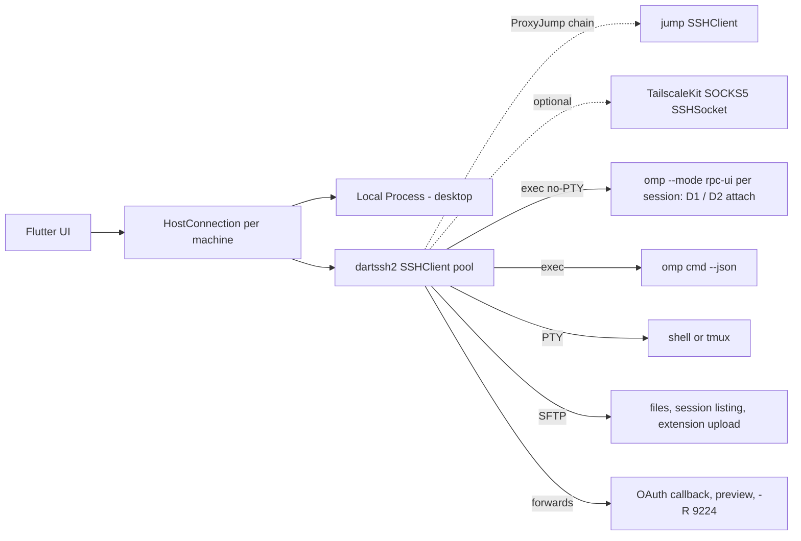

# Remote transport for the omp Flutter GUI — local · SSH · SSH+tunnel · Tailscale

Scope: how a Flutter client (macOS, Windows, Linux, iOS, Android) reaches omp on many machines. User preference: **no host daemon** — drive `omp --mode rpc|rpc-ui` per session over SSH exec channels, plus CLI `--json`, SFTP, PTY. Daemon designs kept secondary.

Citation keys: `ca:` = /tmp/oh-my-pi-18.3.0/packages/coding-agent/src/ · `omp://x.md` = /tmp/oh-my-pi-18.3.0/docs/x.md · `t3:` = https://github.com/pingdotgg/t3code/blob/main/ · `ds2:` = https://github.com/vicajilau/dartssh2/blob/main/ · [INFERENCE] = not verified by source or run.

---
## 0. Decision-relevant findings
1. **Attached RPC dies with its SSH channel.** stdout close/error → `logger.error("RPC output delivery failed")` → `session.dispose()` → `process.exit(1)` (ca:modes/rpc/rpc-mode.ts:837-840, ca:modes/rpc/rpc-output.ts:99-100, omp://rpc.md:71). `dispose` calls `agent.abort()` (ca:session/agent-session.ts:4890-4908) → in-flight turn aborted. stdin EOF → reject pending UI/host-tool/host-URI requests, drain accepted commands, dispose, exit 0 (omp://rpc.md:29, rpc-mode.ts:1745-1755). ⇒ iOS backgrounding/network loss kills running turns in a purely attached design.
2. **Half-open disconnects create orphans + dual writers.** sshd `ClientAliveInterval` default 0 (https://man.openbsd.org/sshd_config) and omp spools stdout to a temp file under backpressure (rpc-output.ts:70-92) → the old rpc process may keep running unseen. omp session files only have per-write cross-process publish locks (ca:session/session-storage.ts:84-95,449-482), not an exclusive lease ⇒ app must own a per-session pid/lease and SIGTERM stale processes before relaunch (SIGTERM → cleanup → exit 143; packages/utils/src/postmortem.ts:580-586).
3. **Daemonless survival is possible on POSIX hosts** (design D2): detached omp with stdin = FIFO held open by a holder process, stdout appended to a JSONL log; clients `tail -c +OFFSET -F` and `cat >> fifo`. Reconnect with exact byte-offset replay and multi-reader, no service. [INFERENCE: recipe assembled from POSIX semantics + omp EOF behavior; needs a smoke test.]
4. **dartssh2 4.1.0** (2026-09-04, MIT) is sufficient as the single SSH stack on all 5 platforms; gaps (agent client, known_hosts, ssh_config, ProxyCommand, compression, certs/FIDO) are app-side work or a desktop OpenSSH fallback.
5. **No maintained Dart ~/.ssh/config parser**; desktop uses `ssh -G`.
6. **Tailscale adds reachability + identity, not persistence**: SSH over 100.x/MagicDNS, optional Tailscale SSH (key-less `none` auth, control-plane host keys). Mobile: rely on the Tailscale app VPN; embedding TailscaleKit is feasible but costly and currently blocked for App Store upload (tailscale#20992).
7. **"SSH with tunneling"** most plausibly = bastion/ProxyJump connection type; port forwarding is still needed per connection (OAuth callbacks, previews, `-R 9224` browser relay, daemon mode). Both specified in §6.
8. **sshd MaxSessions default 10** per TCP connection counts exec/shell/sftp channels → pool connections per host.
9. **T3 Code** = daemon + system-ssh `-L` + pairing tokens; mobile never SSHes. Reuse its launcher/reconnect patterns, not its daemon.

---
## 1. T3 Code remote architecture (reference)
`REMOTE.md` is gone from repo root: moved into docs/ by commit ec18938 (2026-06-05, "Restructure documentation into topical folders (#2963)"); pre-move text read at https://raw.githubusercontent.com/pingdotgg/t3code/5ae77c0d63ece1a3e3fa5a70bc7717aa7c342756/REMOTE.md.

| Aspect | T3 Code behavior | Source |
|---|---|---|
| Split | "Environment" server owns providers, terminals, git, files, durable state (SQLite event log). Web/desktop/mobile clients speak authenticated RPC over HTTP + WebSocket via shared `packages/client-runtime`. | t3:docs/internals/overview.md, t3:docs/internals/remote.md |
| Routes | Direct LAN/tailnet pairing, Tailscale HTTPS, desktop-managed SSH, T3 Connect — "change how the client reaches that server; they do not introduce another execution model". | remote.md |
| Identity | Environment ID stable across restarts/endpoints; endpoints are reachability hints; never silently fall back to loopback. | remote.md |
| SSH bootstrap | Desktop main spawns system `ssh`/`ssh.exe`; `ssh -G <alias>` resolves the target; launcher script piped via stdin to `sh -l -s -- <stateKey>`; installs self-contained `t3-<ver>-<darwin\|linux>-<arm64\|x64>.tar.gz` into `~/.t3/runtime/versions/<ver>` (curl/wget, SHA256SUMS verify, `t3 --version` smoke, mkdir lock); state in `~/.t3/ssh-launch/<stateKey>/{port,pid,managed,server.log,run-t3.sh}`; remote port 3773 (+200 scan) on 127.0.0.1; reuses a running server ("external"). Remote needs Linux or Apple Silicon Mac + curl/wget, tar, sha256sum/shasum. | t3:packages/ssh/src/tunnel.ts (constants, 440-560, 888-890), t3:packages/ssh/src/command.ts, t3:docs/user/remote-access.md |
| Port forward vs stdio | Port forward, not stdio: `ssh -o ExitOnForwardFailure=yes -o ControlMaster=no -o ControlPath=none -o ControlPersist=no -o ServerAliveInterval=15 -o ServerAliveCountMax=3 -n -N -L <local>:127.0.0.1:<remote>` (+`BatchMode`, `ConnectTimeout=10`). | tunnel.ts:1149-1169, command.ts `baseSshArgs` |
| Password prompts | In-app prompt; re-run ssh with an `SSH_ASKPASS` helper script, `SSH_ASKPASS_REQUIRE=force`, secret in env `T3_SSH_AUTH_SECRET`. | t3:packages/ssh/src/auth.ts |
| Host discovery | `~/.ssh/config` `Host` aliases (follows `Include` globs, skips patterns) + `known_hosts` hostnames. | t3:packages/ssh/src/config.ts |
| Pairing/auth | One-time pairing token (CLI/QR/`t3 pair`, or `run-t3.sh auth pairing create --json` over SSH) exchanged for a device session (cookie/bearer/DPoP); short-lived WS tickets minted over HTTP; per-RPC scopes; revocation via Settings/`t3 auth`. Hosted pairing URL keeps secret in fragment. | t3:docs/internals/environment-auth.md, REMOTE.md@5ae77c0 |
| Tailscale | Endpoint provider, not an environment type: `tailscale status --json` → `Self.DNSName` + 100.64/10 IPs; `tailscale serve --bg --https=443 http://127.0.0.1:<port>`; probe `/.well-known/t3/environment`; `t3 serve --tailscale-serve`, `t3 pair --tailscale`. | t3:packages/tailscale/src/tailscale.ts, remote-access.md |
| Reconnect | One supervisor per environment; capped backoff; offline/auth failures wait for wakeup; foreground probes; long mobile suspension forces socket replacement ("OS can kill a socket without reporting closure"); SSH reconnect restores the forward before the app transport; mutations not auto-replayed. | t3:docs/internals/connection-runtime.md, remote.md |
| Process ownership | Removing an SSH environment stops only a launcher-owned server; discovered servers survive. | remote.md, tunnel.ts stop script |
| Multi-client / multi-env | Many devices per environment; many environments per client; optional load balancing of new threads. | remote-access.md |
| Versioning | Clients use advertised capabilities; launcher update protocol with trial/commit/rollback. | overview.md, t3:docs/internals/server-updates.md |
| Mobile | Pairing (QR/URL) or T3 Connect only; "SSH launch is a desktop feature because it needs local process and SSH access". | REMOTE.md@5ae77c0 |
| T3 Connect | Clerk identity; relay mints DPoP-bound bootstrap credential; Cloudflare managed tunnels; idle tunnel reaping. | t3:docs/internals/t3-connect.md |

Patterns worth copying even without a daemon: script via stdin to `sh -l -s` (no quoting hell); tolerate shell noise by extracting the JSON object from stdout (`decodeRemoteJsonOutput`); mkdir as portable atomic lock; checksum + `--version` smoke before marking install complete; owned-vs-external process cleanup; supervisor rules above.

---
## 2. omp facts that shape the transport
### 2.1 RPC process lifecycle (v18.3.0)
| Event | Behavior | Source |
|---|---|---|
| Start | `omp --mode rpc [flags]`; writes `ready` `{protocolVersion:1, supportedProtocolVersions:[1,2], maxFrameBytes:1048576, maxReassembledFrameBytes:67108864}`; v2 via `negotiate_protocol` → lossless `rpc_chunk` frames | omp://rpc.md:17-66 |
| stdout hygiene | RPC sets `PI_NOTIFICATIONS=off` because any non-JSON byte breaks the stream → over SSH, shell rc noise must be skipped until `ready` | ca:modes/rpc/rpc-mode.ts:831-835 |
| Slow reader | spill to private temp file, drain 64 KiB blocks | omp://rpc.md:71; rpc-output.ts:70-92 |
| stdin EOF | reject pending UI/host-tool/host-URI; drain; dispose; exit 0 | omp://rpc.md:29; rpc-mode.ts:1745-1755 |
| stdout close/error | dispose; exit 1 | rpc-mode.ts:837-840 |
| dispose | `agent.abort()` | agent-session.ts:4908 |
| SIGTERM / SIGHUP | cleanup → exit 143 / 129 | packages/utils/src/postmortem.ts:580-586 |
| Session file | `~/.omp/agent/sessions/<encoded-cwd>/<timestamp>_<sessionId>.jsonl` (+ archived `.jsonl.gz`) | omp://session.md:39-43,532 |
| Concurrency | per-write publish locks only | session-storage.ts:449-482 |
| Bandwidth | `message_update` carries the delta and the full accumulating `message` → O(n²) bytes per streamed reply | omp://rpc.md:512,852; omp://collab.md |

Relevant launch flags (omp://cli-reference.md): `--cwd`, `--session/--resume <id|path>`, `--fork <session>`, `--session-dir`, `--profile`, `--no-session`, `-e/--extension <path>` (explicit `-e` works even with `--no-extensions`), `--max-time <dur>` (hard stop), `--approval-mode`, `--mode rpc|rpc-ui|acp`.

CLI `--json` subcommands usable as one-shot exec calls (ca:commands/*.ts `json: Flags.boolean`): agents, auth-broker, auth-gateway, bench, collab, config, dry-balance, find, gc, grievances, if-bench, images, install, models, plugin, ps, setup, skill, ssh, stats, tiny-models, toks, ttsr, usage, worktree. Each is a cold omp start [INFERENCE: multi-second] → batch/cache.

### 2.2 Login over a remote RPC
`login` → `extension_ui_request{method:"open_url", url, launchUrl, instructions}`, then an `input` request (600 s) for the pasted code/redirect URL; providers needing input before the URL are refused in RPC (rpc-mode.ts:1638-1680). Loopback callback ports: anthropic 54545, openai-codex 1455, google-gemini-cli 8085, google-antigravity 51121, gitlab-duo 8080, devin 59653, gitlab-duo-agent 8080, zai-coding-plan 9999 (omp://auth-broker-gateway.md:61). Precedent: `omp auth-broker login --via=user@host` runs `ssh -L <port>:127.0.0.1:<port> user@host omp auth-broker login <provider>`. ⇒ GUI must local-forward the callback port during login, or use the paste fallback (mobile).

### 2.3 omp's own remote bits — reuse or avoid
| Bit | What it is | Evidence | Verdict |
|---|---|---|---|
| `omp ssh add\|remove\|list [--json]` | Host registry for the agent's ssh tool: project `.omp/ssh.json`, user `~/.omp/agent/ssh.json` | ca:cli/ssh-cli.ts, ca:discovery/ssh.ts | Import source only |
| ssh tool, `ssh://` URIs, sshfs | omp → remote (agent acts on other hosts). System ssh with `ControlMaster=auto`, `ControlPath` in `~/.omp/ssh-control`, `ControlPersist=3600`, `BatchMode=yes`, `StrictHostKeyChecking=accept-new`; no ControlMaster on Windows | ca:ssh/connection-manager.ts:19-21,264-271 | Avoid: opposite direction; don't share its mux sockets |
| Host probe cache | `~/.omp/remote-host/<name>.json`; local file: `{"version":4,"os":"linux","shell":"bash","transferShell":"sh","compatEnabled":false}`; probe `echo "$OSTYPE\|$SHELL\|$BASH_VERSION"` + `sh/bash/zsh -lc` round trips; Windows refused for byte transfers | connection-manager.ts:561-563; ca:ssh/file-transfer.ts; ~/.omp/remote-host/colima.json | Reuse the idea, not the files |
| `~/.omp/ssh-control` | empty (no live masters) | read | — |
| auth-broker / auth-gateway | Credential vault daemon (HTTP 127.0.0.1:8765, bearer) shared by many omp clients | omp://auth-broker-gateway.md | Optional: one login for many hosts; it is a daemon (opt-in) |
| Daemon broker (`omp ps`) | Per-scope supervisor on an authenticated unix socket `…/run/daemons/<scope>/broker.sock` + `broker.token`; ops start/list/logs(cursor,follow)/wait/send(data\|signal)/stop/restart/mode(persist\|session\|detached)/describe/shutdown; CLI exposes only list/info/logs/stop/kill/restart | ca:launch/protocol.ts:26-58, ca:launch/paths.ts:49-55, ca:commands/ps.ts:15-37 | Could host a detached rpc process, but the protocol is internal → only with an upstream public CLI/API |
| Collab registry | `omp collab list --json`, `omp collab link <id> [--view] --json`; IPC unix socket/named pipe under `~/.omp/run/collab-hosts` | omp://collab.md | Reuse for optional live attach (§7 D5) |

### 2.4 Installing omp on a remote
- Official: `curl -fsSL https://omp.sh/install | sh` (/tmp/oh-my-pi-18.3.0/README.md:40); Windows `irm https://omp.sh/install.ps1 | iex` (README.md:85).
- scripts/install.sh: `--binary|--source|--ref`; binary `omp-{darwin|linux|linux-musl}-{x64|arm64}` from GitHub releases into `${PI_INSTALL_DIR:-$HOME/.local/bin}/omp` (install.sh:13-16); Rosetta-safe arch via `sysctl hw.optional.arm64`; musl needs `libstdc++ libgcc`; smoke `omp --version`; **no checksum verification**.
- Release assets carry `sha256:` digests in GitHub release metadata (scripts/ci-update-brew-formula.ts:4-6,46-53) → app can verify remotely with `sha256sum`/`shasum -a 256`.
- First run extracts native addons to `~/.omp/natives/<version>/` (observed locally). `omp update` exists.

---
## 3. dartssh2 capability matrix (v4.1.0)
| Capability | Status | Evidence |
|---|---|---|
| Version / repo / license | 4.1.0 published 2026-09-04; https://github.com/vicajilau/dartssh2 (moved from TerminalStudio); MIT | https://pub.dev/api/packages/dartssh2, GitHub API |
| Maintenance | 3.0.0→4.1.0 released 2026-08-16…09-04; 261★, 1 open issue, last push 2026-09-04, not archived | ds2:CHANGELOG.md; GitHub API |
| Platforms | Dart VM + Flutter: Android, iOS, macOS, Windows, Linux (dart:io sockets). Web only with a custom `SSHSocket` (WebSocket bridge), CI-tested; no chacha20 on web | ds2:README.md |
| Pluggable transport | `SSHSocket` interface (WebSocket, unix socket, SOCKS, Process stdio [INFERENCE]) | README |
| Algorithms | KEX curve25519/ECDH/DH-GEX/14; ciphers AES-GCM, chacha20-poly1305, AES-CTR; ETM HMAC-SHA2; host keys ed25519, rsa-sha2-256/512, ecdsa; legacy opt-in; strict-kex (Terrapin); EXT_INFO | README; CHANGELOG 3.1.0, 4.0.0 |
| Compression | ✗ (`compression*: ['none']`) | ds2:lib/src/ssh_transport.dart:1435-1436 |
| Private keys | RSA PKCS#1 PEM (+encrypted), OpenSSH RSA/ECDSA/Ed25519 (+bcrypt-pbkdf encrypted), SEC1 `EC PRIVATE KEY` (unencrypted); writes encrypted OpenSSH | README key table; CHANGELOG 2.7.0, 2.16.0, 4.0.0 |
| PKCS#8, PuTTY .ppk, OpenSSH certs, FIDO `sk-*` | ✗ [INFERENCE: absent from key-pair and host-key type lists] | ds2:lib/dartssh2.dart, ds2:lib/src/hostkey/ |
| Auth methods | password, change-password, keyboard-interactive (`onUserInfoRequest`), publickey (async `SSHIdentity.custom` signers: Secure Enclave, tokens; RFC 4252 §7.8 probing), hostbased, `none` (appended last) | ds2:lib/src/ssh_client.dart:1541-1569 |
| ssh-agent client (SSH_AUTH_SOCK) | ✗ built in. Implementable: `SSHIdentity.custom` + agent msgs 11/13 over a dart:io unix socket [INFERENCE ~150 LOC]; Windows agent is a named pipe → FFI [INFERENCE] | ds2:lib/src/ssh_agent.dart |
| Agent forwarding | ✔ `agentHandler`, in-memory `SSHKeyPairAgent` | ssh_agent.dart; CHANGELOG 2.15.0 |
| Host key check | `onVerifyHostKey(type, SHA256 fingerprint)`; omitted ⇒ accepts all; key change on rekey terminates | README |
| known_hosts / ssh_config | ✗ (app implements) | exports |
| exec / shell / PTY | `execute(cmd, pty:, environment:)`, `shell(pty:)`, `run`/`runWithResult` (exit code/signal), `resizeTerminal`, `kill(SSHSignal)`, `waitForExit`, stdin EOF; `pipelineChannelRequests` (4.1.0) | ssh_client.dart:566-600; ds2:lib/src/ssh_session.dart:92,137 |
| Multiplexing | many sessions/channels per `SSHClient` | README roadmap |
| Local forward | `forwardLocal(host, port)` returns a channel; bind your own `ServerSocket` for a local port | ssh_client.dart:510; README |
| Local → remote unix socket | `forwardLocalUnix(path)` (= `ssh -L port:/path`) | ssh_client.dart:553-556; CHANGELOG 2.14.0 |
| Remote forward | `forwardRemote(host?, port?)`, `cancelForwardRemote` | ssh_client.dart:453-488 |
| Dynamic SOCKS5 | `forwardDynamic` (NO AUTH + CONNECT; dart:io only) | README; CHANGELOG 2.17.0 |
| Jump hosts | `SSHForwardChannel` implements `SSHSocket` → `SSHClient(await jump.forwardLocal(target, 22))`, chainable multi-hop | README; CHANGELOG 2.9.0-pre, 2.14.0 |
| ProxyCommand | ✗ (desktop: custom `SSHSocket` over `Process` stdio [INFERENCE]) | — |
| Keepalive | `keepAliveInterval` default 10 s (`keepalive@openssh.com`); ping errors ignored, no count/timeout → no dead-peer detection | ssh_client.dart:236,306; ds2:lib/src/ssh_keepalive.dart |
| Timeouts | `handshakeTimeout`, `authTimeout` (default none) | README |
| Rekey | `rekey()`; server-initiated rekey | README |
| SFTP | SFTPv3: list, stat, setstat, open, read, write, rename (`posix-rename@openssh.com`), link, mkdir, rmdir, remove, statvfs; pipelined up/down, progress, pause/resume | README; CHANGELOG 2.19.0, 4.0.0 |
| HTTP over SSH | `SSHHttpClient` | CHANGELOG 2.9.1-pre |
| X11 | ✔ | CHANGELOG 2.15.0 |
| Isolates | only DH KEX offloaded; decrypt keys via `compute` | README; CHANGELOG 3.3.1 |
| Maturity | Channel-stall / flow-control bugs fixed only in 3.1.0 (2026-08-17) and 4.0.1 (2026-09-03); breaking 3.0/4.0 → pin exact version | CHANGELOG |

Alternatives:
- **System OpenSSH via `Process` (desktop only).** Gains: full `~/.ssh/config` (Include/Match/ProxyJump/ProxyCommand), any agent (1Password/Secretive/Windows pipe), FIDO2/certs/GSSAPI, hashed known_hosts and `@cert-authority`, compression, ControlMaster (not Windows: connection-manager.ts:19-21). Costs: nothing on iOS/Android; password/OTP needs an SSH_ASKPASS helper (T3 auth.ts); one process per channel without ControlMaster; SFTP only via `sftp` process or shell transfers (omp file-transfer.ts pattern); Windows ssh.exe variance; sandboxed macOS builds cannot use the real HOME/~/.ssh [INFERENCE; ServerBox notes a container HOME in sandboxed apps: https://github.com/lollipopkit/flutter_server_box/blob/main/lib/core/utils/ssh_config.dart].
- `libssh_binding` (pub.dev) — not evaluated.
- **Recommendation:** dartssh2 as the single transport on all five platforms. Desktop helpers: `ssh -G` resolution, agent via `SSHIdentity.custom`, ProxyCommand via Process-backed `SSHSocket`. Optional desktop "OpenSSH compat" transport (same channel abstraction over `ssh -T host cmd` processes) for FIDO/cert/GSSAPI hosts.

Flutter companions (pub.dev API, 2026-09-25): `xterm` 4.0.0 (2024-02-27, stalled); maintained forks `xterm2` 5.2.0 (2026-07-25, MIT) and `xterm3` 6.3.4 (2026-09-24, AGPL-3.0 from 6.0); local PTY `flutter_pty` 0.4.2 (2025-01-06, ffiPlugin incl. Windows ConPTY [INFERENCE]).

---
## 4. ~/.ssh/config in Dart
- pub.dev has no dedicated parser: searches "ssh config", "ssh_config", "known_hosts" return unrelated packages; `/api/packages/ssh_config` and `/api/packages/ssh_config_parser` → 404.
- Desktop: `ssh -G <alias>` → exact effective config (hostname, user, port, identityfile*, proxyjump, proxycommand, userknownhostsfile, identityagent…), including Match/Include. T3: `parseSshResolveOutput` + `resolveSshTarget` (command.ts).
- Alias picker: parse `Host` lines + `Include` globs, skip wildcard patterns (T3 config.ts); add known_hosts hostnames.
- Reference parser: ServerBox `lib/core/utils/ssh_config.dart` (first-match Host patterns, IdentityFile list, multi-hop ProxyJump, ProxyCommand, %-tokens) — **AGPL-3.0**, reference only.
- Mobile: no ~/.ssh → manual entry, import pasted config text, or discovery (§5).

---
## 5. Tailscale options
### 5.1 Option × platform
| Option | macOS | Windows | Linux | iOS | Android | App cost | Notes |
|---|---|---|---|---|---|---|---|
| (a) OS Tailscale client; dial 100.x / MagicDNS | ✔ | ✔ | ✔ | ✔ (Tailscale app VPN) | ✔ (VPN) | ~0 | Plain sockets; only one VPN active on mobile [INFERENCE] |
| (b) Embedded libtailscale/tsnet (FFI) | ✔ c-archive / TailscaleKit | ~ Go c-shared DLL [INFERENCE] | ✔ c-shared | ✔ TailscaleKit userspace (no NEPacketTunnelProvider); **App Store upload rejected ITMS-91053, open** (tailscale#20992); loopback listener goes stale after suspension | ~ not documented [INFERENCE: Go c-shared/NDK] | High: Go toolchain per target, FFI, binary size [INFERENCE], separate node identity (auth key or login URL), Dart can't wrap a raw fd → use `tailscale_loopback` SOCKS5 + custom `SSHSocket` | C API: new/set_dir/set_hostname/set_authkey/set_ephemeral/up/dial/listen/loopback(SOCKS5+LocalAPI)/status_json/funnel (https://github.com/tailscale/libtailscale/blob/main/tailscale.h); Swift pkg: https://github.com/tailscale/libtailscale/blob/main/swift/README.md |
| (c) Tailscale SSH (host feature) | server: OSS tailscaled only; client ✔ | server ✗; client ✔ | server ✔ | client ✔ | client ✔ | Low: allow `none` auth, surface check-mode URL (userauth banner [INFERENCE]), pin netmap host keys | Port 22 only; ACL `ssh` rules; default policy = check mode on own devices; `user+password` workaround for clients that can't do none-auth; restarting tailscaled kills sessions; SFTP supported (https://tailscale.com/docs/features/tailscale-ssh) |
| (d) Tailscale API device list | ✔ | ✔ | ✔ | ✔ | ✔ | Medium UX | Access token 1–90 days, generated only by Owner/Admin/IT/Network admin; or OAuth client `devices:core:read` → `GET /api/v2/tailnet/:tailnet/devices` (https://tailscale.com/docs/reference/tailscale-api, …/trust-credentials) |
| (e) `tailscale status --json` | ✔ `/Applications/Tailscale.app/Contents/MacOS/Tailscale` + `TAILSCALE_BE_CLI=1`, or `/usr/local/bin/tailscale` | ✔ `tailscale.exe` | ✔ | ✗ no CLI | ✗ no CLI | Low | Peer: HostName, DNSName, TailscaleIPs, OS, Online, Tags, `sshHostKeys` (ipnstate.go:321-322); JSON "subject to change" (https://tailscale.com/docs/reference/tailscale-cli) |
| (f) `tailscale serve` (daemon designs only) | ✔ (App Store variant: no file serving) | ✔ | ✔ | n/a | n/a | Low on host | Needs tailnet HTTPS certs; identity headers `Tailscale-User-Login/Name/Profile-Pic` (not for tagged devices); T3: `serve --bg --https=443 http://127.0.0.1:<port>` (https://tailscale.com/docs/features/tailscale-serve) |

### 5.2 What Tailscale adds when nothing listens except sshd
- Reachability for plain SSH: stable 100.x/MagicDNS names, NAT traversal/DERP, no internet-exposed :22, works on cellular.
- Identity: Tailscale SSH replaces per-device key distribution (biggest win on mobile) with tailnet identity + ACLs; check mode adds SSO re-auth. dartssh2 sends `none` when no credentials are configured → works [INFERENCE; smoke-test the publickey-first then none fallback].
- Trust: host keys delivered by the control plane → desktop pre-trusts via `sshHostKeys`; no TOFU prompt.
- Discovery: machine list with OS/online/tags (status JSON on desktop, API everywhere).
- `tailscale nc <host> <port>` works as a desktop ProxyCommand (userspace-networking tailscaled).
- Does **not** keep iOS apps running, add multiplexing, or replace SSH channels.

---
## 6. "SSH with tunneling" — both readings
| Reading | Meaning | dartssh2 | System ssh | Needed for |
|---|---|---|---|---|
| **Jump host / bastion (most plausible as a *connection type*)** | Target reachable only via a gateway | `SSHClient(await jump.forwardLocal(target, 22))`, chain N hops; per-hop auth + host-key checks; ProxyJump list from `ssh -G` | `-J a,b` / `ProxyJump` | corp/homelab bastions; reverse-tunnel VPS (target = `localhost:<R-port>` on the VPS) |
| **Port forwarding (capability of every connection)** | Tunnel a TCP port or unix socket | `forwardLocal` (+local `ServerSocket` bind), `forwardLocalUnix`, `forwardRemote`, `forwardDynamic` | `-L/-R/-D` | OAuth callback ports during RPC `login` (§2.2); previews of dev servers the agent starts; `-R 9224:127.0.0.1:9224` so a remote omp reaches the user's local `omp browser-relay` (default `http://127.0.0.1:9224`, ca:tools/browser/relay/kind.ts:18) [INFERENCE: untested]; T3-style daemon mode (D3) |
- Reverse-tunnel variant (host behind NAT dials out `ssh -R 2222:localhost:22 vps`) = ProxyJump via the VPS; Tailscale makes it unnecessary.
- Verdict: implement ProxyJump chains as a first-class connection option; expose forwards as per-connection features. In the no-daemon design the port-forward reading is only auxiliary.

---
## 7. Transport designs (no-daemon first)
### D1 — Attached RPC over SSH exec (baseline; also local desktop)
- One dartssh2 connection per host (pooled; §8); per open session: exec **without PTY** `"$SHELL" -lc 'exec omp --mode rpc-ui --session <path> --cwd <dir> [-e <ext>]'` [INFERENCE: login shell for env parity]; skip non-JSON stdout until `ready`; negotiate v2; stderr separate.
- One-shots: exec `omp <cmd> --json`. Terminal: PTY `shell()` (tmux `new -A` if present, survives drops). Files: SFTP. Local desktop: `Process.start` with identical framing.
- Record `$$` to `~/.omp-app/run/<sid>.pid` before `exec omp`; on reconnect SIGTERM a live stale pid, relaunch, rebuild via `get_state` + `get_messages_page`.
- Pros: zero host footprint beyond omp; SSH is the only auth; per-session isolation; works on Windows hosts; simplest.
- Cons: disconnect/suspension aborts the running turn; half-open orphans; one client per session process; omp cold start per session and per one-shot; no fan-out.

### D2 — Detached per-session process, attach by tail (still no daemon; POSIX hosts)

Verified on macOS with omp 18.3.0 (`/tmp` probes, 2026-09-25):
- **FIFO stdin does not work.** `omp --mode rpc < fifo` never sees EOF after the last writer closes (still alive after 10 s; Bun stdin on a macOS FIFO). Shutdown would need SIGTERM, and dialog/turn drain semantics are lost.
- **Inbox file + `tail -f` pipe works.** Commands are appended to `in.jsonl`; `tail -c +1 -f in.jsonl | omp --mode rpc` reads them; stdout is appended to `out.jsonl`. Two independent appenders both got responses. Killing `tail` closes the pipe; omp drained and exited 0 in 2 s.

Recipe (sent via stdin to `sh -s -- <sid> <cwd> <sessionPath>`):
```sh
D="$HOME/.omp-app/run/$1"; mkdir -p "$D"; cd "$2" || exit 1
: >> "$D/in.jsonl"
nohup sh -c 'tail -c +1 -f "$0/in.jsonl" & echo $! > "$0/tail.pid"; wait' "$D" 2>/dev/null </dev/null \
  | nohup sh -c 'omp --mode rpc-ui --session "$1"; echo $? > "$0/exit"' "$D" "$3" >> "$D/out.jsonl" 2>> "$D/err.log" &
```
- Attach/replay: exec `tail -c +$((OFF+1)) -F "$D/out.jsonl"`; the client stores the last applied byte offset plus a generation id.
- Send: append one line per command with a single `write()` (`printf '%s\n' "$json" >> in.jsonl` or an SFTP append). Concurrent appenders to a regular file with `O_APPEND` do not interleave within one `write()` on local filesystems [INFERENCE: not a POSIX guarantee]; the app still holds a single-writer lease per session.
- `in.jsonl` doubles as a durable command log; `tail -c +1` replays it from the start, so it must be rotated together with omp restarts (a restarted omp would otherwise re-run old commands).
- Stop gracefully: kill `tail` → EOF → drain/dispose/exit 0; fallback SIGTERM (exit 143). Safety net: `--max-time`. GC run dirs whose omp pid is dead.
- Rotation of `out.jsonl`: truncate between turns (O_APPEND writer continues at 0); clients detect the new generation.
- Not yet verified: survival when the SSH exec channel that launched it closes (expected: all stdio redirected to files, no controlling tty on non-PTY exec), and Linux behaviour.
- Caveats: extension UI requests without timeout wait for the next client (re-render unmatched `extension_ui_request` ids from the log); don't register host tools/URI schemes in detached sessions; other clients aren't told when one answers a dialog [INFERENCE]; Windows hosts unsupported → D1.
- Pros: turns survive disconnects and mobile suspension; exact replay; multi-reader; no service (process lifetime = session lifetime); the same scripts work locally on macOS/Linux, so the UI can quit mid-turn.
- Cons: shell plumbing to own; log growth; lease logic; POSIX-only.
- D2b (not recommended yet): host the rpc process in omp's daemon broker (`start` spec, `send` data, `logs` cursor/follow) — internal token-authenticated protocol, version-coupled; only if upstream publishes it.

### D3 — SSH `-L` to a loopback daemon (T3 style; secondary)
- App-installed server (SDK host or future `omp serve`) on 127.0.0.1:port or a unix socket; reach it via `forwardLocal`/`forwardLocalUnix`/`SSHHttpClient` (no local port needed); token read over SFTP/exec.
- Pros: full SDK parity, one process for many sessions, fan-out, replay, multi-client, survives disconnects.
- Cons: daemon install/update/supervision (T3 needed runtime dir, locks, checksum, launcher protocol, version skew handling); memory; security surface.

### D4 — Direct WSS over tailnet (daemon + `tailscale serve`; secondary)
- Daemon on loopback; `tailscale serve --bg --https=443 http://127.0.0.1:<port>` → valid TLS at `https://<host>.<tailnet>.ts.net`; auth by identity headers or pairing token.
- Pros: no SSH on mobile; TLS for free; tailnet ACLs.
- Cons: daemon; requires tailnet HTTPS and the OS client; headers absent for tagged devices; persistent serve config.

### D5 — Collab relay: attach to live TUI sessions (optional)
- Over SSH exec: `omp collab list --json` → `omp collab link <instanceId> [--view] --json` (bound to `generation`; `stale_generation` on room change) → Dart guest connects to `wss://my.omp.sh/r/<roomId>?role=guest` (collab-web socket.ts:112), AES-256-GCM `[12B IV][ciphertext+tag]` (ca:collab/crypto.ts); 48-byte full link = key + write token, 32-byte = view-only.
- Guest powers: read everything, prompt, interrupt, Agent Hub, answer select/editor. Host-only: `/model`, `/compact`, `/resume`, `/branch`, bash, python, skills… (omp://collab.md).
- Needs the TUI host to publish (`collab.autoStart` view|control or `/collab`); relay is hosted, not self-hostable (dev-only local stand-in); links are bearer secrets.
- Given "TUI sessions: list from disk only": use D5 only for opt-in live attach. Cheap alternative: `tail -F` the TUI session `.jsonl` for message-level (not streaming) read-only updates [INFERENCE]. Never resume a live TUI session over RPC (two writers) → offer read-only or `--fork`.

### Comparison
| | D1 attached | D2 detached | D3 SSH→daemon | D4 tailnet WSS | D5 collab |
|---|---|---|---|---|---|
| Host daemon | none | none (per-session process) | yes | yes | TUI itself |
| Survives disconnect | ✗ turn aborted | ✔ | ✔ | ✔ | ✔ (host keeps running) |
| Replay after reconnect | rebuild from session file | exact byte offset | server-side | server-side | snapshot on join |
| Multi-client | ✗ | readers ✔ / 1 writer | ✔ | ✔ | ✔ |
| Mobile | foreground only | ✔ reattach | ✔ | ✔ (no SSH) | ✔ |
| Windows host | ✔ | ✗ | ✔ | ✔ | ✔ |
| Parity ceiling | RPC + CLI + SFTP | same | full SDK | full SDK | guest subset |
| Build cost | low | medium | high | high | medium |

---
## 8. Recommended stack

Per platform:
| Capability | macOS | Windows | Linux | iOS | Android |
|---|---|---|---|---|---|
| Local omp (Process) | ✔ unsandboxed build [INFERENCE] | ✔ | ✔ | ✗ | ✗ |
| dartssh2 transport | ✔ | ✔ | ✔ | ✔ foreground | ✔ (foreground service for background [INFERENCE]) |
| OpenSSH compat fallback | ✔ | ✔ (no ControlMaster) | ✔ | ✗ | ✗ |
| Config resolution | `ssh -G` | `ssh -G` | `ssh -G` | manual/import | manual/import |
| Agent | unix socket | named pipe via FFI [INFERENCE] | unix socket | ✗ (in-app keys, Secure Enclave P-256 via `SSHIdentity.custom` [INFERENCE]) | ✗ (in-app keys) |
| Tailscale | OS client + status JSON | OS client + status JSON | OS client + status JSON | Tailscale app VPN (+API discovery) | Tailscale app VPN (+API discovery) |
| Local PTY | flutter_pty | flutter_pty | flutter_pty | ✗ | ✗ |
| Remote PTY / SFTP | ✔ | ✔ | ✔ | ✔ | ✔ |
| OAuth callback forward | ✔ | ✔ | ✔ | paste fallback (browser backgrounds the app) [INFERENCE] | same |

Operational rules:
- **Channel budget:** sshd `MaxSessions` default 10 counts exec/shell/sftp per connection (man sshd_config) → open another SSHClient to the same host when a channel open fails; direct-tcpip forwards don't count.
- **Liveness:** dartssh2 keepalive never declares death → wrap `client.ping()` in a timeout (~3×15 s like T3's ServerAliveInterval=15/CountMax=3); probe on app resume and network change; backoff with jitter; pause on auth failure (T3 connection-runtime rules). iOS offers no general background execution for sockets (https://developer.apple.com/documentation/uikit/extending-your-app-s-background-execution-time, https://developer.apple.com/forums/thread/685525) → mobile relies on D2 reattach.
- **Host keys:** implement known_hosts (desktop: read `~/.ssh/known_hosts` incl. hashed `|1|` entries; mobile: app store) + TOFU UI; pre-trust tailnet peers from `sshHostKeys`.
- **Env/PATH:** non-interactive shells often lack `~/.local/bin` → store the absolute omp path from install/probe; `sshd` usually rejects `env` requests beyond `AcceptEnv` [INFERENCE] → pass env on the command line; macOS GUI apps need the same shell-env resolution for local omp [INFERENCE].
- **Bootstrap:** probe script via stdin to `sh -l -s` returns JSON {uname -s/-m, arm64 sysctl, musl, $SHELL, $HOME, `command -v omp`, `omp --version`, curl/wget, sha256 tool, sftp availability}; install = official script (`… | sh -s -- --binary --ref vX`) or app-pinned binary + sha256 + mkdir lock + `--version` smoke; SFTP push from client cache for air-gapped hosts (~200 MB; avoid on cellular); Windows via install.ps1; manual mode shows commands. Companion extension: SFTP to `~/.omp-app/ext/<sha>.ts`, launch with `-e`.
- **Session listing (TUI + GUI):** one exec script emitting `{path,size,mtime,header}` JSONL for `~/.omp/agent/sessions/*/*.jsonl` (1 round trip) instead of N SFTP opens; honor `--profile`/`--session-dir`.
- **Bandwidth:** no SSH compression in dartssh2 and O(n²) `message_update` payloads → prefer v2 frames, coalesce rendering; upstream delta-only option (§9).

---
## 9. Upstream omp asks (transport-specific)
1. RPC over a unix socket with detach/reattach + replay cursor (e.g. `omp --mode rpc --listen unix:<path> --detach`), or a public `omp ps start|send|logs --cursor --json` for the existing broker → makes D2 a supported primitive.
2. Exclusive per-session live lease (refuse a second rpc/TUI writer) → removes dual-writer risk.
3. Opt-in delta-only `message_update` (omit accumulated `message`).
4. A graceful `shutdown` RPC command (no signals/holder tricks).
5. `omp sessions list --json` (list-from-disk without parsing .jsonl over SFTP).

---
## 10. Unverified / open
- D2 survival across SSH channel close and on Linux, dartssh2 → Tailscale SSH none-auth and check-mode banner, `-R 9224` browser relay, Windows agent pipe, Android background service, TailscaleKit on Android: all [INFERENCE], need smoke tests.
- omp cold start measured locally only: 1.7 s to `ready` plus four introspection commands; over SSH not measured.
- Terminal widget: `xterm2` (MIT) vs `xterm3` (AGPL) depends on the app license.
